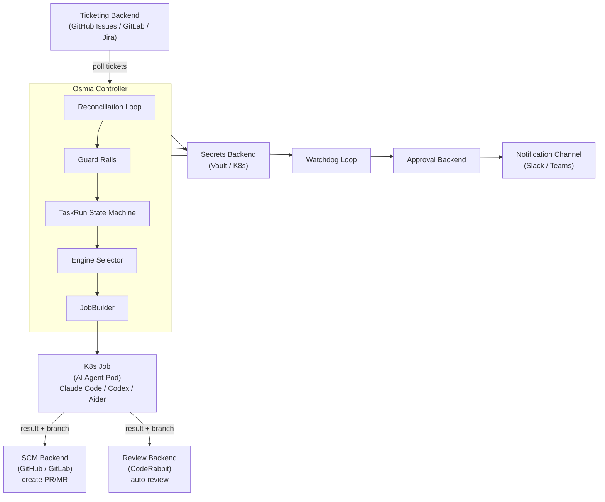
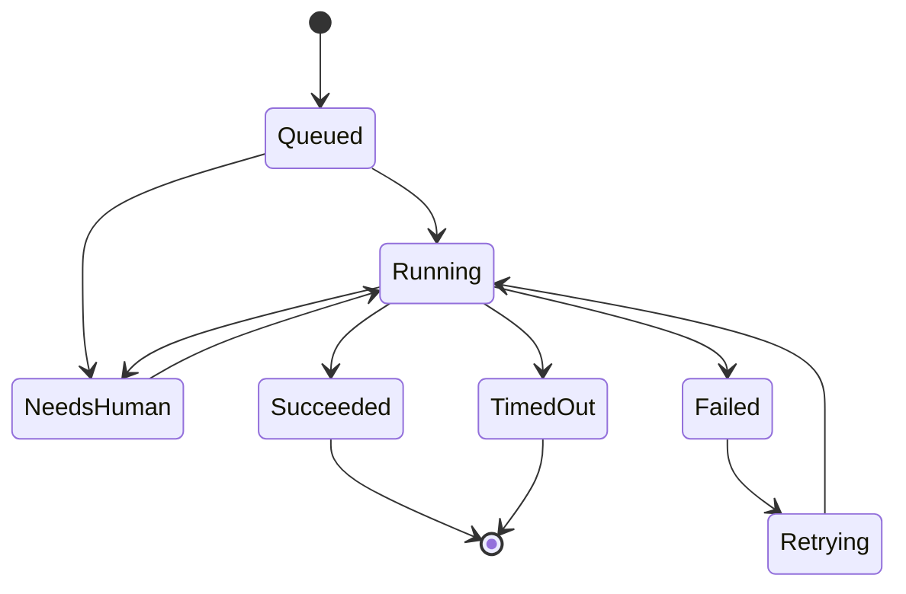
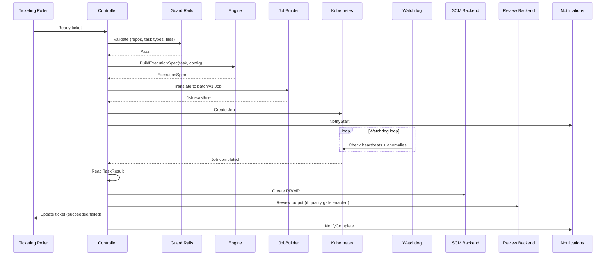

# Architecture

This document describes the architecture of Osmia, a Kubernetes-native controller that orchestrates autonomous AI coding agents to perform development tasks at scale.

For the full technical plan, see `oss-plan.md`. For product requirements, see `oss-prd.md`.

## Overview

Osmia follows the Kubernetes **operator pattern**. A single controller binary runs inside the cluster and drives a reconciliation loop: it polls a ticketing backend for work, translates each ticket into a Kubernetes Job that runs an AI coding agent, monitors the job through to completion, and feeds the result back to the source control and ticketing systems.

The controller does not itself perform any code generation. It is purely an orchestration layer. The actual coding work happens inside short-lived Kubernetes Jobs, each running one of the supported AI engines (Claude Code, OpenAI Codex, or Aider). This separation means the controller can manage many concurrent agents across multiple repositories and organisations without coupling to any single AI provider.

All external integrations -- ticketing, notifications, approvals, secrets, SCM, and code review -- are abstracted behind plugin interfaces. Built-in plugins compile directly into the controller binary; third-party plugins run as separate gRPC subprocesses managed by `hashicorp/go-plugin`.

## System Architecture



## Controller

The controller lives in `internal/controller/` and is built on top of `controller-runtime` and `client-go`. Its `Reconciler` struct drives the entire lifecycle.

### Reconciliation Loop

The loop runs on a configurable poll interval (typically 30-60 seconds). Each tick performs the following steps:

1. **Capacity check** -- count active (non-terminal, non-queued) TaskRuns against the configured `max_concurrent_jobs` limit (default: 5). If the limit is reached, the tick is skipped entirely.
2. **Poll** -- call `PollReadyTickets` on the ticketing backend to retrieve tickets that are ready for processing.
3. **Per-ticket processing** -- for each ticket, up to the remaining capacity:
   - Generate an **idempotency key** (`<ticket_id>-<attempt>`). If a non-terminal TaskRun already exists for this key, the ticket is skipped. This prevents duplicate work when the same ticket appears in consecutive polls.
   - Run **guard rail validation** (see Guard Rails below). If a ticket violates any rule, it is rejected and the ticketing backend is updated.
   - Select the **execution engine** (from configuration, defaulting to `claude-code`).
   - Create a `TaskRun` in `Queued` state, then build an `ExecutionSpec` via the engine.
   - Pass the spec to the `JobBuilder`, which produces a `batch/v1.Job`.
   - Create the Job in Kubernetes via `client-go`.
   - Transition the TaskRun to `Running` and record the Job name.
   - Emit Prometheus metrics (`active_jobs`, `taskruns_total`).
   - Mark the ticket as in-progress and fire start notifications.
4. **Job status check** -- iterate all `Running` TaskRuns, fetch the corresponding Job status from the Kubernetes API, and handle completion or failure.

### Retry Logic

When a Job fails and the TaskRun has not exhausted its `MaxRetries` (default: 1), the controller transitions the TaskRun through `Failed` to `Retrying` and back to `Running`, creating a new Job. The retry count is incremented on each attempt. Once retries are exhausted, the TaskRun enters a terminal `Failed` state, the ticket is marked as failed, and notifications are sent.

### Idempotency

Every TaskRun is keyed by an idempotency key derived from the ticket ID and attempt number. The controller maintains an in-memory map of all TaskRuns, protected by a read-write mutex. Before processing any ticket, the controller checks whether a non-terminal TaskRun already exists for that key. This ensures that a ticket is never processed twice, even if the ticketing backend returns it in multiple consecutive polls.

## TaskRun State Machine

The TaskRun state machine is implemented in `internal/taskrun/`. Each `TaskRun` struct tracks the full lifecycle of a single execution attempt.

### States

| State | Description |
|---|---|
| `Queued` | The TaskRun has been created but no Job has been launched yet. |
| `Running` | A Kubernetes Job is actively executing the AI agent. |
| `NeedsHuman` | The agent has asked a question that requires human intervention. Execution is paused. |
| `Succeeded` | The Job completed successfully and produced a valid result. Terminal state. |
| `Failed` | The Job failed. Terminal if retries are exhausted; otherwise transitions to `Retrying`. |
| `Retrying` | A retry has been scheduled. Transitions back to `Running` when the new Job is created. |
| `TimedOut` | The Job exceeded its deadline. Terminal state. |

### Transition Diagram



### Valid Transitions

The `validTransitions` map enforces the following rules:

- `Queued` may only transition to `Running`.
- `Running` may transition to `NeedsHuman`, `Succeeded`, `Failed`, or `TimedOut`.
- `NeedsHuman` may only transition back to `Running` (once a human responds).
- `Failed` may only transition to `Retrying`.
- `Retrying` may only transition to `Running`.
- `Succeeded` and `TimedOut` are terminal -- no outgoing transitions.

### Heartbeats and Staleness

Each TaskRun carries a `HeartbeatAt` timestamp and a configurable `HeartbeatTTLSeconds` (default: 300 seconds). The agent container is expected to push heartbeats at regular intervals. If the time since the last heartbeat exceeds the TTL, the `IsStale()` method returns true and the watchdog may intervene.

## Execution Engines

The `ExecutionEngine` interface in `pkg/engine/engine.go` decouples AI coding tools from the Kubernetes runtime.

### Interface

```go
type ExecutionEngine interface {
    BuildExecutionSpec(task Task, config EngineConfig) (*ExecutionSpec, error)
    BuildPrompt(task Task) (string, error)
    Name() string
    InterfaceVersion() int
}
```

Each engine implements `BuildExecutionSpec`, which takes a `Task` (containing the ticket ID, title, description, repository URL, and labels) and an `EngineConfig` (image, resources, timeout), and returns an `ExecutionSpec`. The spec is a runtime-agnostic description of what container to run:

```go
type ExecutionSpec struct {
    Image                 string
    Command               []string
    Env                   map[string]string
    SecretEnv             map[string]string
    ResourceRequests      Resources
    ResourceLimits        Resources
    Volumes               []VolumeMount
    ActiveDeadlineSeconds int
}
```

The `JobBuilder` (`internal/jobbuilder/`) then translates this spec into a Kubernetes `batch/v1.Job`, applying security contexts, tolerations, labels, and resource limits.

### Supported Engines

| Engine | Description |
|---|---|
| **Claude Code** | Anthropic's CLI agent. Supports hooks for guard rail enforcement and the experimental agent-teams mode for parallel sub-agents. |
| **Codex** | OpenAI's coding agent. Configured via API key or credentials file. |
| **Aider** | Open-source AI pair programming tool. Supports multiple LLM backends. |

The default engine is `claude-code`, configurable via `osmia-config.yaml`.

### TaskResult

Every engine writes a structured `TaskResult` to `/workspace/result.json` upon completion:

```go
type TaskResult struct {
    Success         bool
    MergeRequestURL string
    BranchName      string
    Summary         string
    TokenUsage      *TokenUsage
    CostEstimateUSD float64
    ExitCode        int  // 0=success, 1=agent failure, 2=guard rail blocked
}
```

## Plugin System

Osmia's plugin system, implemented in `pkg/plugin/`, provides two integration mechanisms:

### Built-in Plugins

Built-in plugins are compiled directly into the controller binary. They implement the relevant Go interface and are registered at startup via functional options (e.g. `WithTicketing`, `WithEngine`, `WithNotifier`). These are first-class citizens with no serialisation overhead.

### Third-party (gRPC) Plugins

Third-party plugins run as separate processes and communicate with the controller over gRPC using `hashicorp/go-plugin`. The plugin host (`pkg/plugin/host.go`) manages their lifecycle:

1. **Spawning** -- the host starts the plugin binary as a subprocess using `exec.Command`.
2. **Handshake** -- a magic cookie (`OSMIA_PLUGIN=osmia`) and protocol version are exchanged to verify compatibility.
3. **Health monitoring** -- the host tracks each plugin's health state and restart count.
4. **Automatic restart** -- if a plugin dies, the host restarts it with exponential backoff (default: 1s, 5s, 30s), up to a configurable maximum restart count (default: 3).
5. **Graceful shutdown** -- on controller termination, all plugin subprocesses are killed.

### Plugin Interfaces

Osmia defines six plugin interfaces. Every interface includes a `Handshake` RPC with an `interface_version` field for forward-compatible version negotiation.

| Interface | Type Constant | Purpose |
|---|---|---|
| **TicketingBackend** | `ticketing` | Polls for ready tickets, marks tickets as in-progress/complete/failed. |
| **NotificationChannel** | `notifications` | Fire-and-forget notifications (e.g. Slack, Microsoft Teams, email). |
| **HumanApprovalBackend** | `approval` | Event-driven human-in-the-loop approval workflow. |
| **SecretsBackend** | `secrets` | Retrieves secrets at runtime (Kubernetes Secrets, HashiCorp Vault, etc.). |
| **SCMBackend** | `scm` | Source control operations -- clone, branch, commit, push, create PR/MR. |
| **ReviewBackend** | `review` | Automated code review (e.g. CodeRabbit, Semgrep). |

All interfaces are defined as protobuf services in `proto/` (the source of truth) and generated into Go, Python, and TypeScript SDKs.

## Guard Rails

Osmia enforces safety through six complementary layers. For full details, see the [Guard Rails documentation](guardrails.md).

1. **Controller validation** -- the reconciler validates each ticket against configurable rules before creating a Job. This includes allowed repository patterns (glob matching), allowed task types, and blocked file patterns. Violations are rejected immediately and the ticket is marked as failed.

2. **Engine hooks** -- for engines that support them (notably Claude Code), hooks run inside the agent container at tool-call boundaries. These hooks can intercept and block dangerous operations (e.g. writing to protected files, executing disallowed commands) before they take effect.

3. **Repository guard rail files** -- `guardrails.md` and `CLAUDE.md` files placed in target repositories provide per-repo instructions that the AI agent may follow. These files are read by the agent naturally during execution (Claude Code reads `CLAUDE.md` automatically). The controller does not currently inject them — prompt-builder injection is on the roadmap.

4. **Task profiles** -- configuration-driven profiles that define cost and duration limits per task type. The config schema is defined and values are stored, but per-task-type file pattern restrictions (`allowed_file_patterns`, `blocked_file_patterns`) are not yet enforced at runtime.

5. **Quality gate** -- an optional post-completion review step. A separate AI engine (or the same one) reviews the agent's output for security issues, OWASP patterns, leaked secrets, and dependency CVEs. Configurable responses include `retry_with_feedback`, `block_mr`, or `notify_human`.

6. **Progress watchdog** -- a continuous monitoring loop that detects stalled, looping, or unproductive agents during execution. See below for details.

## Job Lifecycle

The complete lifecycle of a ticket from discovery to pull request:



The steps in detail:

1. **Poll** -- the ticketing backend returns a ready ticket.
2. **Validate** -- the controller checks guard rails (allowed repos, task types, file patterns).
3. **Build spec** -- the selected engine produces an `ExecutionSpec` containing the container image, command, environment variables, secret references, resource limits, and deadline.
4. **Create job** -- the `JobBuilder` translates the spec into a `batch/v1.Job` with:
   - Labels: `app=osmia-agent`, `osmia.io/task-run-id`, `osmia.io/engine`
   - Security context: `runAsNonRoot`, `runAsUser: 1000`, `readOnlyRootFilesystem`, `allowPrivilegeEscalation: false`, all capabilities dropped, `RuntimeDefault` seccomp profile
   - Tolerations for the `osmia.io/agent` taint (to schedule on dedicated node pools)
   - `BackoffLimit: 0` (retries are handled by the controller, not Kubernetes)
   - `RestartPolicy: Never`
5. **Monitor heartbeats** -- the watchdog loop evaluates heartbeat telemetry from the running agent, checking for loops, thrashing, stalls, cost overruns, and telemetry failures.
6. **Collect result** -- once the Job completes, the controller reads the `TaskResult` from the agent's output (success, branch name, MR URL, token usage, cost).
7. **Create PR/MR** -- the SCM backend creates a pull request or merge request from the agent's branch.
8. **Review** -- if the quality gate is enabled, the review backend performs automated code review.
9. **Update ticket** -- the ticketing backend is updated with the final status (succeeded or failed, with reason).
10. **Notify** -- all configured notification channels are informed of the outcome.

## Progress Watchdog

The watchdog (`internal/watchdog/`) runs as a separate loop alongside the reconciler, checking active TaskRuns at a configurable interval (default: 60 seconds).

### Detection Rules

| Rule | What It Detects | Default Threshold | Default Action |
|---|---|---|---|
| **Loop detection** | Agent calling the same tool with the same arguments repeatedly, with no file progress | 10 consecutive identical calls | `terminate_with_feedback` |
| **Thrashing detection** | High token consumption without meaningful file changes | 80,000 tokens without progress | `warn`, escalating to `terminate_with_feedback` |
| **Stall detection** | No tool calls despite heartbeat still advancing | 300 seconds idle | `terminate` |
| **Cost velocity** | Spending rate exceeds threshold | $15 USD per 10 minutes | `warn` |
| **Telemetry failure** | Heartbeat sequence number not advancing | 3 stale ticks | `warn` |
| **Unanswered human** | `NeedsHuman` state with no response | 30 minutes | `terminate_and_notify` |

### Consecutive Tick Requirement

To avoid false positives, the watchdog requires an anomaly to persist for a configurable number of consecutive ticks (`min_consecutive_ticks`, default: 2) before taking action. If the anomaly resolves before reaching the threshold, the tick counter resets.

### Research Grace Period

Newly created TaskRuns receive a grace period (default: 5 minutes) during which thrashing detection is relaxed, since agents commonly consume many tokens during initial code analysis without yet producing file changes.

### Actions

| Action | Behaviour |
|---|---|
| `terminate` | Kills the Job immediately. |
| `terminate_with_feedback` | Kills the Job and attaches diagnostic feedback to the TaskRun, available for the next retry. |
| `terminate_and_notify` | Kills the Job and sends a notification to the configured channels. |
| `warn` | Logs a structured warning and sets a condition on the TaskRun, but does not terminate. |

Diagnostic `Reason` structs are populated from templates (never from raw agent output) to prevent prompt injection into the watchdog feedback path.

## Intelligence Layer

Seven subsystems extend Osmia's intelligence beyond basic orchestration. **PRM and Memory are fully wired into the controller** — the remaining five have complete packages with unit tests and are tracked for integration in `docs/roadmap.md` under Phase I.

### Subsystem Architecture

```mermaid
graph TD
    subgraph Intelligence["Intelligence Layer"]
        MEM["Episodic Memory<br/>internal/memory/<br/>✅ ACTIVE"]
        PRM["Process Reward Model<br/>internal/prm/<br/>✅ ACTIVE"]
        LLM["LLM Abstraction<br/>internal/llm/<br/>✅ ACTIVE"]
        DIAG["Causal Diagnosis<br/>internal/diagnosis/"]
        CAL["Adaptive Calibrator<br/>internal/watchdog/calibrator"]
        ROUTE["Intelligent Routing<br/>internal/routing/"]
        EST["Cost Estimator<br/>internal/estimator/"]
        TOURN["Tournament<br/>internal/tournament/"]
    end

    subgraph Controller["Controller (Reconciler)"]
        PT["ProcessTicket"]
        HJC["handleJobComplete"]
        HJF["handleJobFailed"]
        SSR["startStreamReader"]
        WD["Watchdog.Check"]
    end

    PT -.->|"predict cost"| EST
    PT -.->|"select engine"| ROUTE
    PT -.->|"start tournament"| TOURN
    SSR -->|"score each step"| PRM
    WD -.->|"calibrated thresholds"| CAL
    HJC -->|"extract knowledge"| MEM
    HJC -.->|"record outcome"| ROUTE
    HJC -.->|"record outcome"| EST
    HJC -.->|"record telemetry"| CAL
    HJF -.->|"diagnose failure"| DIAG
    HJF -->|"extract knowledge"| MEM
    MEM -->|"inject context"| PT
    DIAG -.->|"informed retry"| PT

    style Intelligence fill:#1a1a2e,stroke:#16213e
    style Controller fill:#0f3460,stroke:#16213e
```



Solid lines indicate active integrations. Dashed lines indicate planned integration points (not yet wired).

### Controller-Level Process Reward Model (`internal/prm/`) — Active

The PRM evaluates agent behaviour in real-time using the NDJSON event stream from `internal/agentstream/`. It operates purely on observable telemetry — no agent modification required. The PRM is **wired into the controller**: when `prm.enabled: true`, the controller creates a `prm.Evaluator` per TaskRun, feeds streaming events via `WithEventProcessor`, records interventions with Prometheus metrics, and cleans up evaluators on job completion or failure.

**Flow:** Stream events → rolling window → rule-based scoring (1-10) → trajectory pattern detection → intervention decision.

**Interventions:**
- **Continue** — agent is productive, no action needed
- **Nudge** — log a structured hint with guidance and record on TaskRun
- **Escalate** — signal the watchdog to terminate the Job with diagnostic feedback

**Trajectory patterns detected:** sustained decline (3+ consecutive drops), plateau (5+ identical scores), oscillation (alternating up/down), recovery (3+ consecutive increases).

For full details, see [Real-Time Agent Coaching (PRM)](concepts/prm.md).

### Episodic Memory (`internal/memory/`) — Active

A persistent temporal knowledge graph that accumulates facts across all TaskRuns. Facts have confidence values that decay over time as repositories evolve. Memory is **wired into the controller**: when `memory.enabled: true`, knowledge is extracted on job completion and failure, relevant prior knowledge is queried before building prompts, and a background goroutine handles confidence decay and pruning.

**Node types:**
- `Fact` — a specific observation (e.g. "repo X has flaky test Y", "engine Z fails on Python monorepos")
- `Pattern` — a recurring observation across multiple tasks
- `EngineProfile` — per-engine capability summary

**Storage:** SQLite via `modernc.org/sqlite` (pure Go, no CGO). Auto-migration on startup.

**Temporal weighting:** queries weight facts by `confidence × decay_factor(age)`. Stale facts below a configurable threshold are pruned.

**Cross-tenant isolation:** all queries are scoped by tenant ID. Fact extraction tags each node with the originating tenant.

For full details, see [Episodic Memory](concepts/memory.md).

### LLM Abstraction (`internal/llm/`) — Active

A DSPy-inspired package providing typed, composable LLM interactions for all intelligent subsystems. Defines `Signature` types with typed input/output fields, `Module` interface with `Predict` and `ChainOfThought` implementations, and a `Budget` tracker for per-subsystem cost enforcement. Uses only `net/http` — no external SDK dependency.

For full details, see [LLM Abstraction Layer](concepts/llm.md).

### Causal Diagnosis (`internal/diagnosis/`)

Replaces blind retry with informed corrective action. When a task fails, the analyser classifies the failure mode from the stream transcript, watchdog reason, and result data.

**Failure modes:** `WrongApproach`, `DependencyMissing`, `TestMisunderstanding`, `ScopeCreep`, `PermissionBlocked`, `ModelConfusion`, `InfraFailure`.

**Prescriptions** are generated from safe `text/template` templates (never from raw agent output) to prevent prompt injection into the retry prompt.

**Deduplication:** `DiagnosisHistory` on the TaskRun prevents repeating the same diagnosis — if the same failure mode recurs, the task goes terminal rather than retrying endlessly.

### Adaptive Watchdog Calibration (`internal/watchdog/calibrator.go`, `profiles.go`)

Extends the existing watchdog with per-(repo, engine, task_type) adaptive thresholds. Tracks running percentile statistics (P50, P90, P99) for key telemetry signals from completed TaskRuns.

**Cold-start logic:** requires a minimum of 10 completed TaskRuns for a given profile key before overriding static defaults.

**Profile resolution:** exact match → partial match (e.g. same engine but any repo) → global fallback → static config values.

### Engine Fingerprinting and Routing (`internal/routing/`)

Builds statistical profiles of each engine from historical task outcomes. Uses Laplace-smoothed success rates across dimensions (task type, repo language, repo size, complexity).

**Selection algorithm:** epsilon-greedy — with probability ε (default 0.1), picks a random engine for exploration; otherwise picks the engine with the highest composite score.

**Interface:** implements the existing `EngineSelector` interface, so it's a drop-in replacement for `DefaultEngineSelector`.

### Predictive Cost Estimation (`internal/estimator/`)

Pre-execution cost and duration prediction using multi-dimensional complexity scoring and k-nearest-neighbours from historical data.

**Complexity dimensions:** description length/complexity, label mapping, normalised repo size, task type base complexity.

**Output:** low/high ranges for cost (USD) and duration (minutes) with a confidence score based on sample count.

### Competitive Execution / Tournament (`internal/tournament/`)

For high-value tasks, launches N parallel K8s Jobs (different engines or strategies). A "judge" Job compares the resulting diffs and selects the best solution.

**Lifecycle:** Start → Competing (N candidates running) → Judging (enough candidates complete, judge launched) → Selected/Eliminated (winner chosen, losers cleaned up).

**Early termination:** configurable threshold (default 60% of candidates must complete before triggering judge). Remaining slow candidates are terminated.

---

## Security Architecture

Osmia is a security-first project. For the full threat model and mitigations, see the [Security Model](security.md).

### Container Isolation

Every agent Job is created with a restrictive security context:

```yaml
securityContext:
  runAsNonRoot: true
  runAsUser: 1000
  readOnlyRootFilesystem: true
  allowPrivilegeEscalation: false
  capabilities:
    drop: ["ALL"]
  seccompProfile:
    type: RuntimeDefault
```

Writable paths are limited to explicitly mounted `emptyDir` volumes (e.g. `/workspace`).

### Network Policies

Agent pods should be deployed with Kubernetes `NetworkPolicy` resources that restrict egress to only the required endpoints (API providers, SCM hosts). The Helm chart includes templates for these policies.

### Secret Management

Secrets are never passed as plain-text environment variables in Job specs. Instead, the `SecretEnv` map references Kubernetes Secrets by name, and Kubernetes injects them at pod startup. The `SecretsBackend` plugin interface supports external providers such as HashiCorp Vault. API keys and credentials are never logged.

### Input Validation

All external input -- ticket descriptions, plugin responses, webhook payloads -- is validated before processing. The watchdog's `Reason` structs use templated messages rather than raw agent output to prevent prompt injection.

### Workload Identity

Where possible, Osmia prefers workload identity patterns (AWS IRSA, GCP WIF) over static credentials. The engine configuration supports `bedrock` and `vertex` authentication methods that leverage pod-level identity bindings.

## Observability

### Prometheus Metrics

The controller exposes the following metrics under the `osmia_` namespace:

| Metric | Type | Labels | Description |
|---|---|---|---|
| `osmia_taskruns_total` | Counter | `state` | Total number of TaskRuns by final state. |
| `osmia_taskrun_duration_seconds` | Histogram | `engine` | Duration of TaskRuns. Buckets from 1 minute to ~4 hours (exponential, base 2, 8 buckets). |
| `osmia_active_jobs` | Gauge | -- | Number of currently active Jobs. |
| `osmia_plugin_errors_total` | Counter | `plugin` | Total number of plugin errors by plugin name. |

Metrics are registered via `promauto` and are available at the standard `/metrics` endpoint.

### Structured Logging

All logging uses Go's standard library `slog` package with JSON output. Log entries include structured fields such as `ticket_id`, `task_run_id`, `engine`, `job`, `error`, and `duration`. Context-aware logging (`InfoContext`, `ErrorContext`, `WarnContext`) ensures that request-scoped values propagate correctly.

### Grafana Dashboards

The Helm chart includes provisioning for Grafana dashboards that visualise:

- Active job count over time
- TaskRun success/failure rates by engine
- TaskRun duration distributions
- Plugin error rates
- Cost velocity and token consumption trends
- Watchdog anomaly frequency

## Configuration

All controller behaviour is driven by `osmia-config.yaml`, loaded at startup by the `internal/config/` package. The configuration covers:

- **Ticketing** -- backend selection and connection details
- **Notifications** -- one or more notification channels
- **Secrets** -- backend selection (Kubernetes Secrets, Vault, etc.)
- **Engines** -- default engine, per-engine image/auth/resource settings
- **Guard rails** -- max cost per job, concurrent job limit, duration limit, allowed repos, blocked file patterns, task types
- **Plugin health** -- max restarts, backoff schedule, critical plugin list
- **Quality gate** -- enabled/disabled, review engine, security checks, failure action
- **Tenancy** -- shared or namespace-per-tenant mode
- **Progress watchdog** -- interval, thresholds, and actions for each detection rule

Environment variables can override configuration values where appropriate, following twelve-factor principles.
