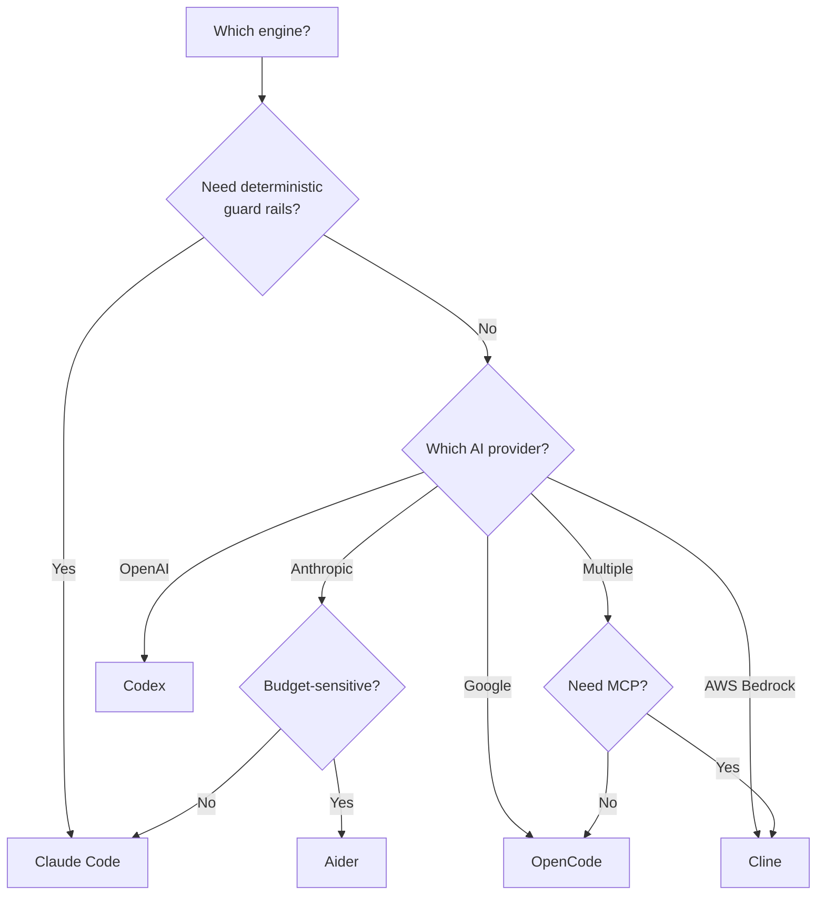

# Engines Explained

An **engine** is an AI coding tool that RoboDev runs inside a container to complete tasks. The controller doesn't write code itself — it delegates to engines. Think of the controller as a dispatcher and the engine as the worker.

## Which Engine Should I Use?



**Short answer:** Use **Claude Code** unless you have a specific reason not to. It has the best guard rail support (hook-based, not just prompt-based) and built-in heartbeat telemetry for the watchdog.

## Comparison

| Feature | Claude Code | Codex | Aider | OpenCode | Cline |
|---|---|---|---|---|---|
| **Guard rails** | Hook-based (deterministic) | Prompt-based | Prompt-based | Prompt-based | Prompt-based |
| **AI provider** | Anthropic | OpenAI | Anthropic or OpenAI | Anthropic, OpenAI, or Google | Anthropic, OpenAI, Google, or Bedrock |
| **Heartbeat telemetry** | Built-in via hooks | Not built-in | Not built-in | Not built-in | Not built-in |
| **Agent teams** | Yes (experimental) | No | No | No | No |
| **MCP support** | Yes | No | No | No | Yes |
| **Repo context file** | `CLAUDE.md` | `AGENTS.md` | `.aider/conventions.md` | `AGENTS.md` | `.clinerules` |
| **Best for** | General-purpose, large refactors | OpenAI shops | Lightweight edits, cost-sensitive | BYOM flexibility | Bedrock, MCP integration |
| **Pre-built image** | ✅ | ✅ | ✅ | ✅ | ❌ Community template |

## What "Hook-Based" vs "Prompt-Based" Guard Rails Means

This is the most important difference between engines.

**Hook-based (Claude Code):** RoboDev generates scripts that run before and after every tool call. If the agent tries to run `rm -rf /` or write to a `.env` file, the hook script blocks it *before it happens*. The agent sees the rejection and adjusts its approach. This is deterministic — the rule always fires.

**Prompt-based (all others):** Guard rails are appended to the task prompt as text instructions ("Do NOT execute destructive commands..."). The AI model *usually* follows them, but there's no hard enforcement. A sufficiently confused or jailbroken model could ignore them.

!!! warning "Prompt-based guard rails are advisory"
    If your security requirements demand strict enforcement of file access or command restrictions, use Claude Code. For lower-risk tasks (documentation, test fixes), prompt-based engines are usually fine.

## Engine Fallback Chains

You can configure a fallback chain so that if one engine fails, the next is tried:

```yaml
engines:
  default: claude-code
  fallback_engines: [codex, aider]
```

The controller tries `claude-code` first. If it fails, it tries `codex`. If that also fails, it tries `aider`. This is useful for resilience against API outages or rate limits.

!!! note
    Do not use `cline` in a fallback chain. No pre-built Cline image is published — see [Engine Reference](../plugins/engines.md#cline) for details.

## Per-Task Engine Override

You can override the engine for a specific task by adding a label to the issue:

- `engine:codex` — use Codex for this task
- `engine:aider` — use Aider for this task

This takes priority over the configured default.

## Cost Considerations

Different engines have different cost profiles depending on the underlying model:

| Engine | Typical Cost Range | Notes |
|---|---|---|
| Claude Code | $1–$50 per task | Depends on model (Opus vs Sonnet vs Haiku) and task complexity |
| Codex | $1–$30 per task | OpenAI pricing |
| Aider | $0.50–$20 per task | Can use cheaper models |
| OpenCode | Varies | Depends on provider |
| Cline | Varies | Depends on provider; Bedrock pricing may differ |

Use `max_cost_per_job` in your guard rails to cap spending per task regardless of engine.

## Intelligent Routing

RoboDev is building an intelligent task routing system (`internal/routing/`) that replaces static fallback chains with data-driven engine selection. Instead of always trying `claude-code → cline → aider` in order, the router will learn which engine is best for each combination of task type, repo language, repo size, and complexity.

**How it works:**

1. After each task completes, the outcome (success/failure, cost, duration) is recorded against the engine that ran it.
2. Per-engine "fingerprints" build up over time — statistical profiles of where each engine excels.
3. When a new task arrives, the router scores each available engine and picks the most likely to succeed.
4. An epsilon-greedy exploration factor (default 10%) ensures the system occasionally tries non-optimal engines to discover new strengths.

This will be transparent — Prometheus metrics will show which engine is being selected and why. Cold-start behaviour falls back to the static fallback chain until enough data accumulates (minimum 5 outcomes per engine).

## Competitive Execution / Tournaments

For high-value tasks, RoboDev will be able to launch multiple engines in parallel (a "tournament"), have a judge compare the results, and select the best solution. This uses genuinely different engines (Claude Code vs Aider vs Cline) running in isolated git worktrees.

## Next Steps

- [Engine Reference](../plugins/engines.md) — full configuration details for each engine
- [Guard Rails Overview](guardrails-overview.md) — the six safety layers
- [Configuration Reference](../getting-started/configuration.md) — how to configure engines in your values
