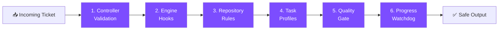
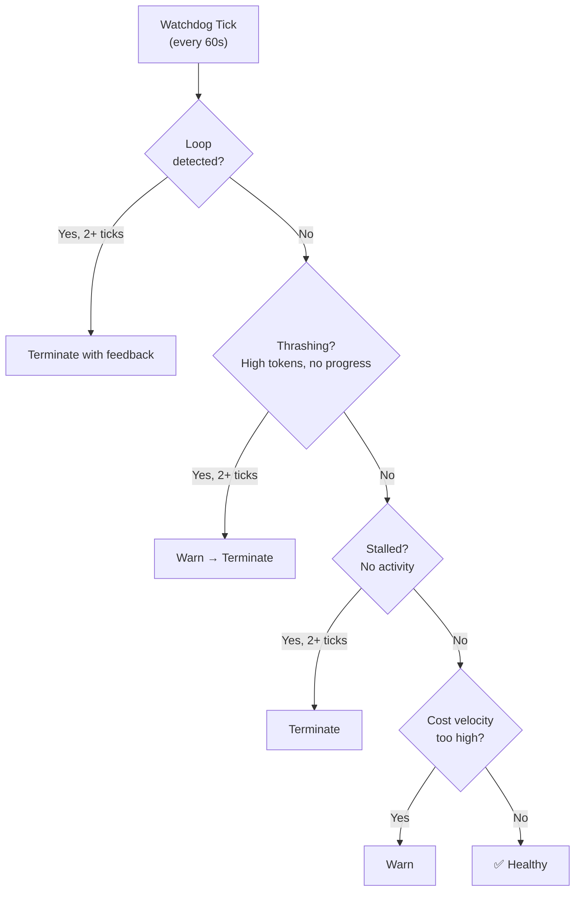

# Guard Rails Overview

Guard rails are safety boundaries that prevent AI agents from doing things they shouldn't. Osmia has **six independent layers** of protection — if one layer fails, the others still catch the problem.

## The Six Layers



### Layer 1: Controller Validation

**When:** Before any agent starts working.
**What:** The controller checks the ticket against configurable rules before creating a job.

| Check | What It Prevents |
|---|---|
| Allowed repositories | Agent working on repos it shouldn't touch |
| Allowed task types | Agent performing task categories that aren't approved |
| Concurrent job limit | Too many agents running at once (resource exhaustion) |
| Blocked file patterns | Agent modifying sensitive files (injected into engine config) |

If a ticket fails validation, it is rejected immediately and marked as failed with the reason.

### Layer 2: Engine Hooks

**When:** During agent execution, before every tool call.
**What:** Scripts that intercept and block dangerous operations in real time.

!!! info "Only Claude Code supports hook-based guard rails"
    Other engines (Codex, Aider, OpenCode, Cline) use prompt-based rules which are advisory, not enforced.

Blocked operations include:

- `rm -rf /`, `sudo`, `eval`, `chmod 777` — destructive commands
- `curl | bash`, `wget | sh` — remote code execution
- `git push --force` to main/master — destructive SCM operations
- Writing to `.env`, `*.pem`, `*.key` — sensitive files

If a hook blocks an operation, the agent sees the rejection and adjusts its approach.

### Layer 3: Repository Rules

**When:** Read by the agent from the target repository during execution.
**What:** A `guardrails.md` or `CLAUDE.md` file in the target repository that tells the agent what it must (and must not) do.

!!! note "Advisory — not enforced by the controller"
    The controller does not currently inject these files into the agent prompt. Claude Code reads `CLAUDE.md` automatically when it starts work; other engines do not. Prompt-builder injection for all engines is on the roadmap.

Example `guardrails.md` (for Claude Code via `CLAUDE.md`):

```markdown
## Never Do
- Never modify CI/CD pipeline configuration files
- Never change database migration files
- Never alter authentication or authorisation logic

## Always Do
- Always run the full test suite before creating a PR
- Always add tests for new functionality
```

These rules are repo-specific and maintained by the repository owners.

### Layer 4: Task Profiles

**When:** Applied when the controller selects the engine configuration.
**What:** Different task types get different cost/duration budgets.

```yaml
guardrails:
  task_profiles:
    documentation:
      allowed_file_patterns: ["*.md", "docs/**"]
      max_cost_per_job: 10.0
    bug_fix:
      blocked_file_patterns: ["**/migrations/**", "**/auth/**"]
      max_cost_per_job: 50.0
```

!!! note "Config schema only — file pattern enforcement not yet wired"
    `max_cost_per_job` and `max_job_duration_minutes` overrides per task type are read from config. However, `allowed_file_patterns` and `blocked_file_patterns` at the profile level are not yet enforced at runtime — only the global `blocked_file_patterns` is injected into engine hooks. Per-profile enforcement is on the roadmap.

### Layer 5: Quality Gate

**When:** After the agent finishes, before the PR is created.
**What:** A separate review step that checks the agent's output.

The quality gate can:

- Scan for accidentally committed secrets
- Check for OWASP security patterns
- Verify the agent followed guard rail instructions
- Check dependency changes for known CVEs

On failure, it can retry with feedback, block the PR, or notify a human.

### Layer 6: Progress Watchdog

**When:** Continuously, while the agent is running.
**What:** Monitors agent behaviour and terminates unproductive agents.



| Detection Rule | What It Catches | Default Threshold |
|---|---|---|
| **Loop detection** | Agent calling the same tool with the same arguments repeatedly | 10 consecutive identical calls |
| **Thrashing** | High token consumption without file changes | 80,000 tokens without progress |
| **Stall** | No tool calls despite heartbeat advancing | 300 seconds idle |
| **Cost velocity** | Spending rate too high | $15 USD per 10 minutes |
| **Telemetry failure** | Heartbeat stopped advancing | 3 stale ticks |
| **Unanswered human** | `NeedsHuman` state with no response | 30 minutes |

!!! tip "Avoiding false positives"
    All detection rules require the anomaly to persist for `min_consecutive_ticks` (default: 2) before action is taken. New TaskRuns also get a `research_grace_period` (default: 5 minutes) during which thrashing detection is relaxed, since agents often consume many tokens during initial code analysis.

### Layer 7: Real-Time Agent Coaching (PRM)

**When:** Continuously, while the agent is running (alongside the watchdog).
**What:** Evaluates agent productivity at each tool call and intervenes with guidance before problems escalate.

!!! info "Only applies to Claude Code"
    The PRM operates on the NDJSON event stream which is only available from the Claude Code engine. Other engines are not scored by the PRM.

The Process Reward Model (PRM) operates on the NDJSON event stream from Claude Code. It scores each evaluation window of tool calls on a 1-10 scale, tracks the score trajectory over time, and decides interventions:

- **Score ≥ 7:** Agent is productive, continue.
- **Score 4-6 with negative trend:** Write a hint file (`/workspace/.osmia-hint.md`) with targeted guidance — "Your approach appears to be oscillating. Try committing to a single strategy."
- **Score ≤ 3 with sustained decline:** Escalate to the watchdog for termination.

Unlike the watchdog (which detects anomalies in raw telemetry), the PRM evaluates *productivity patterns* — whether the agent is making meaningful progress toward the goal, not just whether it's alive.

## Coming Soon

> **Status:** Scaffolding complete, integration pending. See `docs/roadmap.md` Phase I.

### Layer 8: Adaptive Watchdog Calibration

**When:** Applied automatically once enough historical data accumulates.
**What:** Replaces static watchdog thresholds with adaptive per-(repo, engine, task_type) thresholds.

A bug fix in a small Python script has radically different "normal" telemetry from a TypeScript monorepo refactor. Static thresholds either miss real anomalies in simple tasks or fire false positives on complex ones. Adaptive calibration learns what "normal" looks like for each context from historical TaskRun data.

Cold-start safety: a minimum of 10 completed TaskRuns for a given context is required before calibrated thresholds override static defaults.

## How the Layers Work Together

Consider this scenario: a ticket asks the agent to "update the deployment manifest."

1. **Controller validation** checks that the repo is in `allowed_repos` — ✅ pass.
2. **Engine hooks** would block writes to `.github/workflows/**` if configured — ✅ blocked if needed.
3. **Repository guardrails.md** says "Never modify CI/CD pipeline configuration" — the agent should avoid it (advisory).
4. **Task profile** for `infrastructure` type defines a lower cost budget — ✅ enforced. (File pattern enforcement is on the roadmap.)
5. **Quality gate** scans the output and flags if deployment files were changed — ✅ caught.
6. **Watchdog** ensures the agent doesn't loop endlessly trying to find the right file — ✅ monitored.

Even if layer 3 (prompt-based) is ignored by the agent, layers 2 and 5 still catch the problem.

## Next Steps

- [Guard Rails (Detailed)](../guardrails.md) — full configuration reference for all guard rail options
- [Security Model](../security.md) — threat model and defence-in-depth architecture
- [Configuration Reference](../getting-started/configuration.md) — how to configure guard rails in your values
