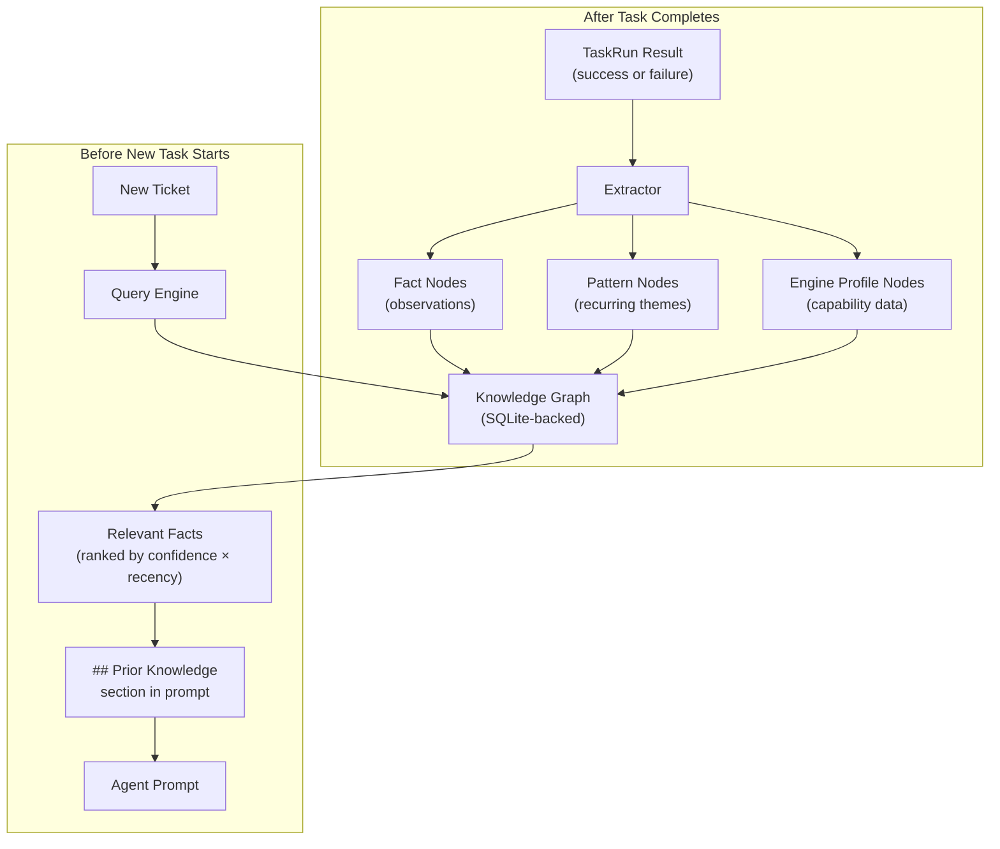

# Episodic Memory

Osmia's **episodic memory** system accumulates structured knowledge from every completed task — successes and failures alike — and injects relevant prior knowledge into future task prompts. Over time, Osmia learns which approaches work, which repositories have quirks, and which engines struggle with specific task types.

## Why Memory Matters

Without memory, every task starts from scratch. The same mistakes are repeated, the same workarounds are rediscovered, and institutional knowledge lives only in human heads. With memory enabled, Osmia builds a compounding knowledge base that makes every subsequent task more likely to succeed.

**Key benefits:**

- **Compounding intelligence** — each completed task makes the next one better
- **Cross-engine learning** — knowledge from Claude Code tasks benefits Aider tasks and vice versa
- **Failure prevention** — prior failure patterns are surfaced before they recur ("this repo has a known flaky test in `auth_test.go`")
- **Temporal awareness** — knowledge decays over time as repositories evolve, so stale facts don't mislead agents
- **Multi-tenant isolation** — tenant A's knowledge is never exposed to tenant B

## How It Works

Memory operates in two phases: **extraction** (after a task completes) and **injection** (before a new task starts).



### Extraction

When a task completes (successfully or not), the controller runs the memory extractor in a background goroutine. The extractor analyses the TaskRun metadata and produces:

**Fact nodes** — specific observations with confidence scores:

- "Repo `org/backend` requires `go mod tidy` after dependency changes" (confidence: 0.85)
- "Claude Code failed on `org/monorepo` due to repository size" (confidence: 0.70)
- "Test `TestAuthFlow` in `org/api` is flaky — intermittent timeouts" (confidence: 0.60)

**Pattern nodes** — recurring observations across multiple tasks:

- "Bug fix tasks on Python repositories succeed 90% of the time with Claude Code"
- "Documentation tasks rarely need more than 10 minutes"

**Engine profile nodes** — per-engine capability summaries:

- "Claude Code: strong at Go refactoring, weak at large monorepos"
- "Aider: fast for small changes, slower for multi-file refactors"

### Temporal Decay

Knowledge doesn't last forever. Repositories evolve, flaky tests get fixed, and engine capabilities change with each release. Memory implements temporal decay:

1. Each fact has a **confidence** value (0.0–1.0) and a **decay rate**
2. A background goroutine runs at a configurable interval (default: 24 hours) and multiplies each fact's confidence by `(1 - decay_rate)`
3. Facts whose confidence drops below the **prune threshold** (default: 0.05) are permanently removed

This ensures the knowledge graph stays relevant without manual curation.

### Query and Injection

Before building an execution spec for a new task, the controller queries memory:

1. The query engine searches the graph for facts relevant to the ticket's **description**, **repository**, and **engine**
2. Results are ranked by `confidence × recency_weight`
3. The top facts are formatted into a `## Prior Knowledge` section
4. This section is injected into the agent's prompt via the `MemoryContext` field on `engine.Task`

The prompt builder includes the memory section after the guard rails and before the engine identifier, so the agent sees it as part of its briefing.

## Configuration

Enable memory in your `osmia-config.yaml`:

```yaml
memory:
  enabled: true
  store_path: "/data/memory.db"       # SQLite database path
  decay_interval_hours: 24            # Hours between decay cycles
  prune_threshold: 0.05               # Remove facts below this confidence
  max_facts_per_query: 10             # Maximum facts injected per prompt
  tenant_isolation: true              # Enforce cross-tenant boundaries
```

### Configuration Fields

| Field | Type | Default | Description |
|---|---|---|---|
| `enabled` | bool | `false` | Enables episodic memory |
| `store_path` | string | `/var/lib/osmia/memory.db` | Path to the SQLite database file |
| `decay_interval_hours` | int | `24` | Hours between confidence decay cycles |
| `prune_threshold` | float | `0.05` | Facts below this confidence are pruned |
| `max_facts_per_query` | int | `10` | Maximum facts returned per query |
| `tenant_isolation` | bool | `true` | Whether to enforce tenant boundaries on queries |

### Storage

Memory uses SQLite via `modernc.org/sqlite` — a pure Go implementation with no CGO dependency. The database is created automatically on first use with auto-migration. For production deployments, ensure the `store_path` points to persistent storage (e.g. a PVC).

!!! tip "Use a PersistentVolumeClaim"
    In Kubernetes, mount a PVC at the `store_path` directory so memory survives pod restarts:
    ```yaml
    # In your Helm values.yaml
    persistence:
      memory:
        enabled: true
        size: 1Gi
        mountPath: /data
    ```

## Node Types

### Facts

The fundamental unit of knowledge. Each fact is a single observation with metadata:

| Field | Description |
|---|---|
| `content` | The observation text (e.g. "repo X has a flaky test Y") |
| `fact_kind` | Category: `success_pattern`, `failure_pattern`, `repo_quirk`, `general` |
| `confidence` | Current confidence (0.0–1.0), decays over time |
| `decay_rate` | Per-cycle decay factor (e.g. 0.05 = 5% decay per cycle) |
| `valid_from` | When this fact was observed |
| `tenant_id` | Owning tenant for isolation |

### Patterns

Higher-level observations derived from multiple facts:

| Field | Description |
|---|---|
| `description` | The pattern description |
| `frequency` | How often this pattern has been observed |
| `confidence` | Statistical confidence in the pattern |

### Engine Profiles

Per-engine capability summaries built from historical outcomes:

| Field | Description |
|---|---|
| `engine` | Engine name (e.g. "claude-code") |
| `strengths` | Areas where the engine excels |
| `weaknesses` | Areas where the engine struggles |
| `sample_count` | Number of tasks the profile is based on |

## Edge Relations

Nodes are connected by typed edges:

| Relation | Meaning |
|---|---|
| `relates_to` | Two facts are about the same topic |
| `contradicts` | Two facts conflict (newer one has higher confidence) |
| `supersedes` | A fact replaces an older one |

## Prometheus Metrics

| Metric | Type | Labels | Description |
|---|---|---|---|
| `osmia_memory_nodes_total` | Gauge | `type` | Total nodes in the graph by type |
| `osmia_memory_queries_total` | Counter | `engine` | Total memory queries |
| `osmia_memory_extractions_total` | Counter | `outcome` | Total extraction runs by task outcome |
| `osmia_memory_confidence_distribution` | Histogram | — | Distribution of fact confidence values |

## Architecture

```
internal/memory/
├── types.go       — Node, Edge, and MemoryContext type definitions
├── graph.go       — Thread-safe knowledge graph with decay and pruning
├── store.go       — SQLiteStore with auto-migration
├── extractor.go   — Heuristic post-task knowledge extraction
├── query.go       — QueryEngine with temporal-weighted retrieval
└── *_test.go      — Unit tests
```

## Multi-Tenant Isolation

When `tenant_isolation: true` (the default), all memory operations are scoped by tenant ID:

- **Extraction** tags every new node with the originating tenant
- **Queries** filter results to the requesting tenant's nodes only
- **Decay and pruning** operate across all tenants (stale facts are pruned regardless of tenant)

This ensures that sensitive information (repo structures, failure patterns, approaches) from one tenant never leaks to another.

## Backwards Compatibility

Memory is **disabled by default**. When disabled:

- No SQLite database is created
- No background goroutines run
- No memory context is injected into prompts
- Zero overhead on the controller

Enabling memory is a pure additive change — existing TaskRuns and prompts are unaffected.

## Example: What an Agent Sees

When memory is enabled and has accumulated knowledge, a new task prompt might include:

```markdown
## Prior Knowledge

The following observations from previous tasks may be relevant:

- **Failure pattern** (confidence: 0.82): The `auth` package in this repository
  has a known race condition in `TestConcurrentLogin` — run tests with `-count=1`
  to avoid false failures.
- **Success pattern** (confidence: 0.75): Previous bug fixes in this repository
  succeeded by focusing changes on the `internal/handler/` directory.
- **Engine note** (confidence: 0.68): Claude Code handles Go refactoring tasks
  well in this repository but struggles with the frontend TypeScript code.
```

## Future Work

- **LLM-based extraction (v2)**: replace heuristic extraction with an LLM call using `internal/llm/` for richer, more nuanced knowledge extraction
- **Provenance tracking**: include the source TaskRun ID in injected facts so agents can reference the original context
- **Memory dashboard**: visualise the knowledge graph in the web UI, showing fact relationships and confidence trends
