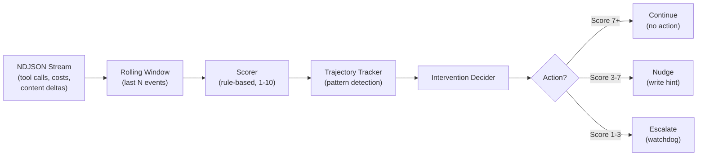

# Real-Time Agent Coaching (PRM)

The **Process Reward Model** (PRM) is Osmia's real-time quality assurance system. While an AI agent works on a task, the PRM continuously evaluates its behaviour by analysing the NDJSON event stream — scoring each step, detecting trajectory patterns, and intervening before small problems become expensive failures.

## Why PRM Matters

Without real-time coaching, an AI agent can spend 30 minutes and $15 going in circles before anyone notices. The PRM catches unproductive patterns within seconds and intervenes with targeted guidance — turning a failed $15 run into a successful $5 run.

**Key benefits:**

- **Early detection** — identifies repetitive loops, stalls, and declining productivity before they escalate
- **Targeted guidance** — produces specific hints rather than generic "try again" instructions
- **Cost savings** — stops wasteful agent behaviour early, reducing token spend by up to 60% on failing tasks
- **No agent modification** — operates purely on observable telemetry; works with any engine that produces streaming events
- **Configurable thresholds** — tune sensitivity per-environment so the PRM nudges when you want it to

## How It Works

The PRM operates as a pipeline that runs alongside the agent's event stream:



### 1. Event Collection

When streaming is enabled, Claude Code emits an NDJSON event stream containing tool calls, content deltas, cost updates, and results. The PRM's event processor is wired into the `agentstream.Forwarder` via `WithEventProcessor`, so it receives every event in real-time without buffering the entire stream.

### 2. Scoring

The scorer evaluates a rolling window of recent tool calls. It considers:

| Signal | Effect on Score |
|---|---|
| **Diverse tool usage** (Read → Edit → Bash) | Increases score (productive pattern) |
| **Repetitive tool calls** (Bash → Bash → Bash) | Decreases score (likely looping) |
| **File progress** (new files read/edited) | Increases score |
| **No progress** (same files repeatedly) | Decreases score |
| **Tool call frequency** | Very high frequency with no file changes penalised |

Scores range from 1 (completely unproductive) to 10 (highly productive). The scorer runs every `evaluation_interval` events (default: 5).

### 3. Trajectory Pattern Detection

Individual scores are tracked over time in a trajectory. The PRM detects four patterns:

| Pattern | Description | Typical Cause |
|---|---|---|
| **Sustained Decline** | 3+ consecutive score drops | Agent going off-track |
| **Plateau** | 5+ identical low scores | Agent stuck in a loop |
| **Oscillation** | Alternating up/down scores | Agent undoing and redoing work |
| **Recovery** | 3+ consecutive score increases | Agent self-correcting (good) |

### 4. Intervention

Based on the current score and trajectory pattern, the decider chooses an action:

- **Continue** — the agent is productive, no action needed
- **Nudge** — log a structured hint with specific guidance (e.g. "Consider a different approach — you've been editing the same file 8 times without running tests")
- **Escalate** — signal the watchdog to consider terminating the job with diagnostic feedback

## Configuration

Enable PRM in your `osmia-config.yaml`:

```yaml
prm:
  enabled: true
  evaluation_interval: 5        # Evaluate every N tool calls
  window_size: 10               # Rolling window of recent events
  score_threshold_nudge: 7      # Score below this triggers a nudge
  score_threshold_escalate: 3   # Score below this triggers escalation
  hint_file_path: "/workspace/.osmia-hint.md"
  max_trajectory_length: 50     # Maximum trajectory points stored
```

### Configuration Fields

| Field | Type | Default | Description |
|---|---|---|---|
| `enabled` | bool | `false` | Enables PRM scoring of agent tool calls |
| `evaluation_interval` | int | `5` | Number of tool calls between evaluations |
| `window_size` | int | `10` | Number of recent events in the scoring window |
| `score_threshold_nudge` | float | `7.0` | Scores below this produce a nudge intervention |
| `score_threshold_escalate` | float | `3.0` | Scores below this produce an escalation |
| `hint_file_path` | string | `/workspace/.osmia-hint.md` | Path where hints are written in the agent pod |
| `max_trajectory_length` | int | `50` | Maximum number of trajectory points retained |

### Tuning Tips

- **Start conservative**: set `score_threshold_nudge: 5` and `score_threshold_escalate: 2` to avoid false positives, then tighten thresholds as you observe real agent behaviour
- **Increase `window_size`** for long-running tasks (60+ minutes) to smooth out natural variations
- **Decrease `evaluation_interval`** for expensive engines where early detection saves more money

## Prometheus Metrics

The PRM exposes the following metrics:

| Metric | Type | Labels | Description |
|---|---|---|---|
| `osmia_prm_step_scores` | Histogram | `engine` | Distribution of step scores (1-10) |
| `osmia_prm_interventions_total` | Counter | `action` | Total interventions by type (continue/nudge/escalate) |
| `osmia_prm_trajectory_patterns_total` | Counter | `pattern` | Trajectory pattern detections |

## Architecture

The PRM is implemented in `internal/prm/` with the following components:

```
internal/prm/
├── scorer.go          — Rule-based step scoring
├── trajectory.go      — Pattern detection across score history
├── intervention.go    — Intervention types and decision logic
├── evaluator.go       — Orchestrates the full PRM pipeline
└── *_test.go          — Table-driven unit tests
```

The controller creates one `prm.Evaluator` per active TaskRun when PRM is enabled. The evaluator is stored in a thread-safe map and cleaned up when the job completes or fails.

## Backwards Compatibility

PRM is **disabled by default** and has **zero overhead** when disabled. The controller behaves identically to a PRM-less deployment — no additional goroutines, no scoring, no memory allocation for evaluators. Enabling PRM is a pure additive change.

## Future Work

- **LLM-based scoring (v2)**: replace the rule-based scorer with an LLM call using the `internal/llm/` package for richer, more contextual evaluation
- **Pod-level hint delivery**: write hints directly to the agent pod via a projected ConfigMap volume
- **Escalation-to-watchdog integration**: direct signalling from PRM escalation to watchdog termination
