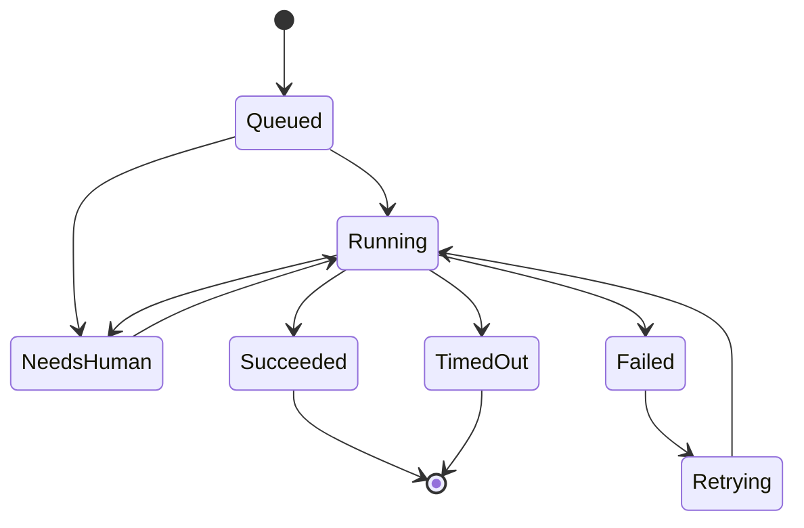
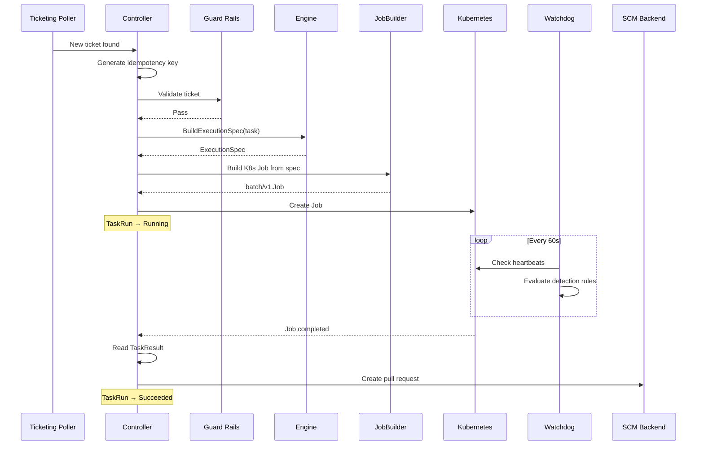

# How a TaskRun Works

A **TaskRun** represents a single attempt to complete a task. When Osmia picks up a labelled issue, it creates a TaskRun that tracks the work from start to finish — including retries, timeouts, and human intervention.

## State Machine

Every TaskRun moves through a set of states. The transitions are enforced by the controller — invalid transitions are rejected.

## States Explained

| State | What's Happening |
|---|---|
| **Queued** | The TaskRun has been created but no agent container has been launched yet. This is the initial state. |
| **Running** | An AI agent container is actively working on the task — cloning the repo, reading code, making changes, running tests. |
| **NeedsHuman** | The agent has asked a question that requires human input. Execution is paused until someone responds. |
| **Succeeded** | The agent finished successfully and produced a result (typically a pull request). This is a terminal state. |
| **Failed** | The agent failed. If retries are available, the TaskRun moves to `Retrying`. If retries are exhausted, this is terminal. |
| **Retrying** | A retry has been scheduled. The controller will create a new agent container and transition back to `Running`. |
| **TimedOut** | The agent exceeded its deadline (`max_job_duration_minutes`). This is a terminal state. |

## Lifecycle Walkthrough

Here is the complete lifecycle of a TaskRun, from issue discovery to pull request:

### Step by Step

1. **Ticket discovered** — the ticketing poller finds a labelled issue and hands it to the controller.

2. **Idempotency check** — the controller generates a key from the ticket ID and attempt number. If a non-terminal TaskRun already exists for this key, the ticket is skipped. This prevents duplicate work.

3. **Guard rail validation** — the ticket is checked against controller-level rules (allowed repos, allowed task types, concurrent job limit, blocked file patterns). If it fails, the ticket is rejected.

4. **Engine selection** — the controller picks an engine (from config or ticket labels) and calls `BuildExecutionSpec` to produce a container specification.

5. **Job creation** — the `JobBuilder` translates the spec into a Kubernetes Job with security contexts, resource limits, tolerations, and environment variables. The TaskRun transitions to **Running**.

6. **Agent execution** — the container starts, clones the repository, and works on the task. It sends heartbeats so the watchdog knows it is alive.

7. **Watchdog monitoring** — a background loop checks all running TaskRuns for anomalies (loops, stalls, cost overruns). See [Guard Rails Overview](guardrails-overview.md).

8. **Completion** — when the agent finishes, it writes a `result.json` with the outcome. The controller reads it and transitions the TaskRun to **Succeeded** or **Failed**.

9. **Knowledge extraction** — if [episodic memory](memory.md) is enabled, the controller extracts knowledge from the completed task (success patterns, failure insights, engine notes) into the persistent knowledge graph. This runs in a background goroutine and does not block the TaskRun.

10. **PR creation** — on success, the SCM backend creates a pull request from the agent's branch.

11. **Notification** — the ticketing backend is updated and notifications are sent.

## Retries

If a job fails and retries remain (default `max_retries: 1`), the controller transitions through `Failed` → `Retrying` → `Running`, creating a new agent container. The retry count increments each time. Once retries are exhausted, the TaskRun enters a terminal **Failed** state.

Retry is useful for transient failures (API timeouts, rate limits). Persistent failures (invalid credentials, unsupported task) will fail again — the quality of error messages helps humans decide whether to retry manually.

### Continuation strategies

When an agent hits `--max-turns` and a retry is triggered, the retry pod needs to know where to pick up. Osmia supports two continuation strategies:

| Strategy | Default? | Engine support | How it works |
|---|---|---|---|
| **Git-based** | Yes | All engines | The prior run pushes its branch. The retry prompt includes `## Continuation` with instructions to clone that branch and read `git log --oneline -20` |
| **Session persistence** | Opt-in | Claude Code only | The `~/.claude/` directory and workspace are stored on a PVC. The retry pod resumes with `--resume <session-id>`, restoring the full conversation — no git-clone needed, no wasted turns |

Session persistence eliminates the main downside of git-based continuation: the retry agent must infer context from git history alone, spending turns re-reading code it already understood. With `--resume`, the agent continues as if the pod never restarted.

> **Note:** Session persistence currently requires the Claude Code engine. It is configured via `session_persistence` on `ClaudeCodeEngineConfig` and relies on Claude Code's `--resume` flag and `$CLAUDE_CONFIG_DIR` for session state storage. Other engines (Codex, Aider, OpenCode) use git-based continuation only.

See [Session Persistence](../plugins/engines.md#session-persistence) in the Claude Code engine docs for configuration details.

### Causal Diagnosis (Coming Soon)

> **Status:** Scaffolding complete, integration pending. See `docs/roadmap.md` Phase I.

Osmia is building a causal diagnosis system (`internal/diagnosis/`) that replaces blind retries with informed corrective action. When a task fails, a diagnosis pipeline analyses the stream transcript, watchdog reason, and result data to classify the failure:

| Failure Mode | Example | Corrective Action |
|---|---|---|
| `WrongApproach` | Agent edited wrong files | "Focus specifically on [scope]. Do not modify files outside [area]." |
| `DependencyMissing` | `module not found` errors | "Before starting, ensure [dependency] is available." |
| `TestMisunderstanding` | Agent modified test files | "Do not modify test files. The existing tests define expected behaviour." |
| `ScopeCreep` | Too many files changed | "Limit changes to at most [N] files." |
| `PermissionBlocked` | `EACCES` errors | "Try [alternative approach] that doesn't require elevated permissions." |
| `ModelConfusion` | Repeated undo/redo cycles | "Take a step-by-step approach." |
| `InfraFailure` | OOMKilled, timeout | Engine switch or resource adjustment |

The diagnosis is injected into the retry prompt alongside the original task, and the system can optionally switch to a different engine if the failure is engine-specific.

## Heartbeats and Staleness

Each TaskRun carries a `HeartbeatAt` timestamp. The agent container is expected to push heartbeats at regular intervals (via the PostToolUse hook). If the time since the last heartbeat exceeds `heartbeat_ttl_seconds` (default: 300), the TaskRun is considered stale and the watchdog may intervene.

## Idempotency

Every TaskRun is keyed by `<ticket_id>-<attempt>`. The controller checks this key before processing any ticket. This ensures:

- A ticket is never processed twice in the same poll cycle.
- Restarted controllers do not duplicate in-flight work.
- Retries get a new attempt number and are tracked separately.

## Real-Time Monitoring

While a TaskRun is in the **Running** state, two monitoring systems operate in parallel:

- **[Progress watchdog](guardrails-overview.md)** — detects loops, stalls, thrashing, and cost overruns using heartbeat telemetry
- **[PRM (Process Reward Model)](prm.md)** — when enabled, scores agent productivity at each tool call and intervenes with guidance before problems escalate

Both systems operate non-invasively on observable telemetry — neither modifies the agent's behaviour directly.

## Next Steps

- [Guard Rails Overview](guardrails-overview.md) — the six safety layers protecting every TaskRun
- [Real-Time Agent Coaching (PRM)](prm.md) — how the PRM scores and coaches agents
- [Episodic Memory](memory.md) — how knowledge accumulates across tasks
- [Engines Explained](engines.md) — which AI agent runs inside the container
- [Architecture: System Overview](../architecture.md) — the full system design
