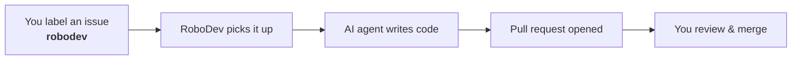
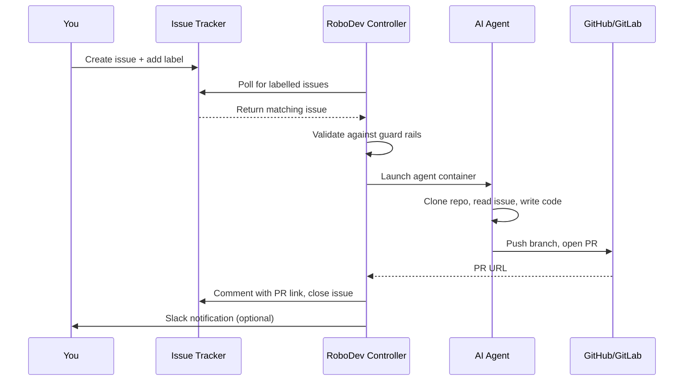

# What is RoboDev?

RoboDev is an open-source tool that connects your issue tracker to AI coding agents. When you label an issue, RoboDev picks it up, runs an AI agent (like Claude Code or Codex) against your codebase, and opens a pull request with the result. It handles the orchestration so you don't have to — scheduling work, enforcing safety rules, retrying on failure, and notifying your team.

## The Happy Path

That's the core workflow. Everything else — guard rails, multiple engines, plugins, scaling — exists to make this loop safe, reliable, and configurable for teams of any size.

## What Problems Does It Solve?

**Repetitive maintenance tasks pile up.** Dependency upgrades, test fixes, documentation updates, small bug fixes — these tasks are well-defined but tedious. They sit in backlogs for weeks because humans have higher-priority work.

**Running AI agents manually doesn't scale.** You can open Claude Code or Codex locally and give it a task, but that ties up your machine and your attention. You can't run ten tasks in parallel, and you can't enforce consistent safety rules.

**Enterprise teams need guardrails.** Letting an AI agent modify production codebases requires cost limits, file access controls, audit logging, and human approval workflows. RoboDev provides these out of the box.

## How It Works (No Kubernetes Jargon)

1. **You create an issue** in GitHub, GitLab, or Jira describing a task.
2. **You add a label** (e.g. `robodev`) to signal that RoboDev should handle it.
3. **RoboDev's controller** notices the label, checks safety rules, and decides which AI agent to use.
4. **A container starts** running the AI agent with your codebase checked out.
5. **The agent works** — reading code, making changes, running tests.
6. **A pull request is opened** with the agent's changes, and the original issue is updated with a link.
7. **You review the PR** like any other — approve, request changes, or close.

## What Are Guard Rails?

Guard rails are safety boundaries that prevent the AI agent from doing things it shouldn't. RoboDev has six independent layers:

1. **Controller validation** — checks the issue against rules before starting (allowed repos, task types, concurrent job limits).
2. **Engine hooks** — intercepts dangerous commands (like `rm -rf` or `sudo`) before they execute.
3. **Repository rules** — a `guardrails.md` file in your repo tells the agent what it must never do.
4. **Task profiles** — different task types have different permissions (e.g. documentation tasks can only edit `.md` files).
5. **Quality gate** — an optional review step that checks the agent's output for security issues before the PR is created.
6. **Progress watchdog** — monitors the agent while it runs and terminates it if it gets stuck in a loop or burns through tokens without progress.

These layers work independently — a failure in one doesn't compromise the others. See [Guard Rails Overview](guardrails-overview.md) for details.

## What Are Engines?

An engine is an AI coding tool that RoboDev can run. The controller doesn't write code itself — it delegates to engines:

| Engine | What it is |
|---|---|
| **Claude Code** | Anthropic's CLI coding agent (recommended) |
| **Codex** | OpenAI's coding agent |
| **Aider** | Open-source AI pair programming tool |
| **OpenCode** | Terminal-based, supports multiple LLM providers |
| **Cline** | MCP and AWS Bedrock support *(community template — no pre-built image)* |

You configure a default engine and optional fallbacks. If one engine fails, the next is tried automatically. See [Engines Explained](engines.md) for a comparison.

## What Are Plugins?

Plugins let RoboDev connect to different services. There are six types:

| Plugin Type | What It Connects To |
|---|---|
| **Ticketing** | GitHub Issues, GitLab Issues, Jira, Shortcut |
| **Notifications** | Slack, Microsoft Teams, Discord, email |
| **Secrets** | Kubernetes Secrets, HashiCorp Vault, AWS Secrets Manager |
| **SCM** | GitHub, GitLab (for cloning repos and opening PRs) |
| **Approval** | Human-in-the-loop approval workflows |
| **Review** | CodeRabbit, Semgrep (automated code review) |

Built-in plugins (like GitHub Issues and Slack) ship with RoboDev. You can write custom plugins in any language that supports gRPC. See [Writing a Plugin](../plugins/writing-a-plugin.md).

## Do I Need Kubernetes?

For production use, yes — RoboDev runs as a Kubernetes operator. But for evaluation and local development, you can use [Docker Compose](../getting-started/docker-compose.md) to try it without a cluster.

## Next Steps

- [Quick Start: Docker Compose](../getting-started/docker-compose.md) — try it locally in 5 minutes
- [Quick Start: Kubernetes](../getting-started/kubernetes.md) — deploy on a real cluster
- [How a TaskRun Works](taskrun-lifecycle.md) — understand the execution lifecycle
- [Engines Explained](engines.md) — choose the right AI agent for your workload
