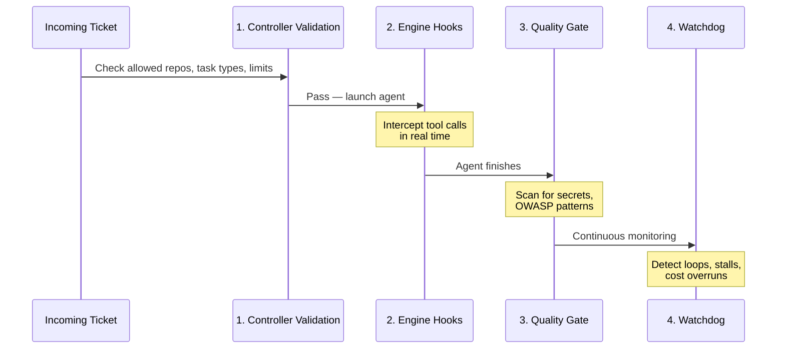

# Guard Rails

## Overview

Osmia provides layered safety boundaries — guard rails — to ensure autonomous AI agents operate within enterprise-approved limits. Guard rails are applied at multiple levels for defence in depth.

!!! tip "New to guard rails?"
    For a plain-language introduction, see [Guard Rails Overview](concepts/guardrails-overview.md). This page covers the detailed configuration reference.



## 1. Controller-Level Guards

Applied before a job is created. Configured in `osmia-config.yaml`:

```yaml
guardrails:
  max_cost_per_job: 50.00
  max_concurrent_jobs: 5
  max_job_duration_minutes: 120
  allowed_repos:
    - "org/frontend-*"
    - "org/backend-*"
  blocked_file_patterns:
    - "*.env"
    - "**/secrets/**"
    - "**/credentials/**"
  require_human_approval_before_mr: false
  allowed_task_types:
    - "dependency_upgrade"
    - "test_fix"
    - "bug_fix"
    - "documentation"
```

### What Each Guard Does

| Guard | Effect |
|-------|--------|
| `max_cost_per_job` | Terminates jobs exceeding the USD budget |
| `max_concurrent_jobs` | Queues new tickets when limit is reached |
| `max_job_duration_minutes` | Sets `activeDeadlineSeconds` on K8s Jobs |
| `allowed_repos` | Rejects tickets for repositories not matching glob patterns |
| `blocked_file_patterns` | Injected into engine hooks to prevent modification |
| `require_human_approval_before_mr` | Pauses before PR creation for human sign-off |
| `allowed_task_types` | Rejects tickets with disallowed task types |

## 2. Engine-Level Guards (Claude Code Hooks)

!!! info "Only applies to Claude Code"
    Engine hooks are only available for the Claude Code engine. Other engines (Codex, Aider, OpenCode, Cline) rely on prompt-based rules which are advisory, not enforced.

Applied inside the execution container via Claude Code's hooks system. Osmia generates a `settings.json` file mounted into the container:

```json
{
  "hooks": {
    "PreToolUse": [
      {
        "matcher": "Bash",
        "hooks": [
          {
            "type": "command",
            "command": "/opt/osmia/hooks/block-dangerous-commands.sh"
          }
        ]
      },
      {
        "matcher": "Write|Edit",
        "hooks": [
          {
            "type": "command",
            "command": "/opt/osmia/hooks/block-sensitive-files.sh"
          }
        ]
      }
    ],
    "PostToolUse": [
      {
        "hooks": [
          {
            "type": "command",
            "command": "/opt/osmia/hooks/heartbeat.sh"
          }
        ]
      }
    ]
  }
}
```

### Blocked Commands

The `block-dangerous-commands.sh` hook blocks:
- `rm -rf /` and similar destructive commands
- `curl | bash`, `wget | bash` (remote code execution)
- `eval` with untrusted input
- `sudo` (privilege escalation)
- `chmod 777` (insecure permissions)
- `git push --force` to main/master

### Blocked Files

The `block-sensitive-files.sh` hook blocks writes to:
- `.env*` files
- `**/credentials/**`
- `**/secrets/**`
- `*.pem`, `*.key` (private keys)

Custom patterns can be added via the `BLOCKED_FILE_PATTERNS` environment variable.

## 3. Custom Guard Rails via Markdown (Planned)

!!! note "Not yet wired"
    The `guardrails.md` injection path is not currently wired in the controller. The `TaskProfileConfig` struct has a `Workflow` field and the promptbuilder package exists, but the controller builds execution specs directly from ticket fields rather than routing through the promptbuilder. This feature is on the roadmap.

The intention is that users will provide a `guardrails.md` file (mounted from a ConfigMap) that the prompt builder appends to every agent prompt, giving the agent advisory rules such as:

```markdown
# Guard Rails

## Never Do
- Never modify CI/CD pipeline configuration files
- Never change database migration files

## Always Do
- Always run the full test suite before creating an MR
```

## 4. Per-Task-Type Permission Profiles (Partially Implemented)

!!! note "Config schema only"
    `task_profiles` is present in the config schema and values are stored, but per-task-type file pattern restrictions (`allowed_file_patterns`, `blocked_file_patterns`) are not enforced at runtime. The controller reads `AllowedTaskTypes` for validation but does not yet apply profile-level constraints to agent pods.

The `task_profiles` config structure is defined for future enforcement:

```yaml
guardrails:
  task_profiles:
    dependency_upgrade:
      allowed_file_patterns:
        - "pyproject.toml"
        - "requirements*.txt"
      max_cost_per_job: 30.00
      max_job_duration_minutes: 60

    bug_fix:
      blocked_file_patterns:
        - "**/migrations/**"
        - "**/auth/**"
      max_cost_per_job: 50.00

    documentation:
      allowed_file_patterns:
        - "*.md"
        - "docs/**"
      blocked_commands:
        - "git push"
      max_cost_per_job: 10.00
```

The controller selects the profile based on ticket labels or the `ticket_type` field from the ticketing backend.

## 5. Quality Gate

An optional post-completion review that runs as a separate K8s Job:

```yaml
quality_gate:
  enabled: true
  mode: "post-completion"
  engine: claude-code
  max_cost_per_review: 5.00
  security_checks:
    scan_for_secrets: true
    check_owasp_patterns: true
    verify_guardrail_compliance: true
    check_dependency_cves: true
  on_failure: "retry_with_feedback"
```

The quality gate is read-only — it cannot modify the repository.

## 6. Progress Watchdog

Detects agents that are stalled, looping, or unproductive during execution:

```yaml
progress_watchdog:
  enabled: true
  check_interval_seconds: 60
  min_consecutive_ticks: 2
  research_grace_period_minutes: 5
  loop_detection_threshold: 10
  thrashing_token_threshold: 80000
  stall_idle_seconds: 300
  cost_velocity_max_per_10_min: 15.00
  unanswered_human_timeout_minutes: 30
```

### Detection Rules

| Rule | Detects | Action |
|------|---------|--------|
| Loop detection | Same tool call repeated N times | Terminate with feedback |
| Thrashing | High token use, no file changes | Warn, then terminate |
| Stall | No tool calls for N seconds | Terminate |
| Cost velocity | Spending > $X per 10 minutes | Warn |
| Telemetry failure | Heartbeat stopped advancing | Warn |
| Unanswered human | NeedsHuman with no response | Terminate and notify |

All terminate actions require the anomaly to persist for at least `min_consecutive_ticks` checks to prevent false positives.
