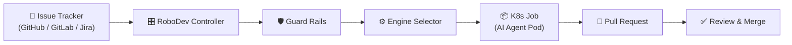

---
hide:
  - navigation
---

# RoboDev

**Kubernetes-native AI coding agent harness.** Orchestrate Claude Code, OpenAI Codex, Aider, and OpenCode to perform maintenance and development tasks on your codebases — autonomously, at scale, with enterprise-grade guard rails.

<div class="grid cards" markdown>

-   :material-rocket-launch:{ .lg .middle } **5-Minute Quick Start**

    ---

    Get RoboDev running locally with Docker Compose — no Kubernetes required.

    [:octicons-arrow-right-24: Docker Compose quick start](getting-started/docker-compose.md)

-   :material-kubernetes:{ .lg .middle } **Deploy on Kubernetes**

    ---

    Install with Helm, configure GitHub Issues + Claude Code, and run your first task.

    [:octicons-arrow-right-24: Kubernetes quick start](getting-started/kubernetes.md)

-   :material-shield-check:{ .lg .middle } **Six Layers of Guard Rails**

    ---

    Controller validation, engine hooks, repo-level rules, task profiles, quality gates, and a progress watchdog.

    [:octicons-arrow-right-24: Guard rails overview](concepts/guardrails-overview.md)

-   :material-puzzle:{ .lg .middle } **Extensible Plugin System**

    ---

    Ticketing, notifications, secrets, SCM, approvals, and reviews — all pluggable via gRPC.

    [:octicons-arrow-right-24: Writing a plugin](plugins/writing-a-plugin.md)

</div>

## How It Works



RoboDev watches your issue tracker for labelled tickets, validates them against configurable guard rails, spins up a sandboxed AI coding agent in a Kubernetes Job, and opens a pull request with the result. The entire flow is automated, observable, and safe.

## Key Features

| Feature | Description |
|---|---|
| **Multi-engine** | Claude Code, Codex, Aider, OpenCode — with automatic fallback chains |
| **Defence in depth** | Six independent guard rail layers prevent unsafe agent behaviour |
| **Plugin architecture** | Extend ticketing, notifications, secrets, SCM, approvals, and reviews via gRPC |
| **Kubernetes-native** | Operator pattern with leader election, Karpenter integration, and KEDA scaling |
| **Observable** | Prometheus metrics, structured JSON logging, Grafana dashboards |
| **Multi-tenant** | Namespace-per-tenant isolation with dedicated RBAC, secrets, and quotas |
| **Secure by default** | Distroless images, read-only filesystems, drop-all capabilities, network policies |

## Intelligent Agent Management

RoboDev goes beyond basic orchestration with integrated intelligence systems that improve agent performance over time:

| Subsystem | Status | What It Does |
|---|---|---|
| **[Real-Time Agent Coaching (PRM)](concepts/prm.md)** | **Active** | Scores agent productivity at each tool call and intervenes with guidance before problems escalate |
| **[Episodic Memory](concepts/memory.md)** | **Active** | Accumulates knowledge across all tasks — prior failures, repo quirks, and engine strengths feed into future prompts |
| **[LLM Abstraction](concepts/llm.md)** | **Active** | DSPy-inspired typed signatures, composable modules, and budget-aware LLM calls for all subsystems |
| **[Causal Diagnosis](concepts/diagnosis.md)** | **Active** | Classifies why a task failed and generates targeted corrective instructions for retry |
| **[Adaptive Watchdog](concepts/guardrails-overview.md#layer-8-adaptive-watchdog-calibration)** | **Active** | Learns what "normal" looks like per repo/engine/task type and adjusts anomaly thresholds |
| **[Intelligent Routing](concepts/engines.md#intelligent-routing)** | **Active** | Routes tasks to the engine most likely to succeed based on historical data |
| **[Cost Estimation](concepts/estimator.md)** | **Active** | Predicts cost and duration before launch — "Predicted: $12-18, 45-90 min" |
| **[Competitive Execution](concepts/engines.md#competitive-execution--tournaments)** | **Active** | Runs multiple engines in parallel, judges results, selects the best solution |

## Project Layout

The repository is organised as follows:

```
cmd/robodev/              — Main entrypoint for the controller binary
internal/                 — Private packages used only by the controller
  controller/             — controller-runtime reconciler (reconciliation loop)
  jobbuilder/             — Translates ExecutionSpecs into Kubernetes Jobs
  sandboxbuilder/         — Sandbox CR builder (gVisor / Kata runtime classes)
  taskrun/                — TaskRun state machine, idempotency, and store
  watchdog/               — Progress watchdog loop (loop/stall/thrash detection)
  agentstream/            — Real-time NDJSON streaming from agent pods
  config/                 — Configuration loading and validation
  metrics/                — Prometheus metric definitions
  webhook/                — Webhook receiver (GitHub / GitLab / Slack / Shortcut / generic)
  secretresolver/         — Task-scoped secret resolution and policy enforcement
  promptbuilder/          — Prompt construction with task profiles and workflows
  prm/                    — Process Reward Model for real-time agent coaching
  memory/                 — Episodic memory with temporal knowledge graph
  diagnosis/              — Causal failure diagnosis and informed retry
  routing/                — Engine fingerprinting and intelligent task routing
  estimator/              — Predictive cost and duration estimation
  tournament/             — Competitive execution with tournament selection
pkg/                      — Public packages importable by plugins and SDKs
  engine/                 — ExecutionEngine interface and built-in engine implementations
  plugin/                 — gRPC plugin host and all six plugin interfaces
proto/                    — Protobuf definitions (source of truth for all interfaces)
charts/robodev/           — Helm chart for deploying RoboDev on Kubernetes
docker/                   — Dockerfiles for the controller and each engine
  controller/             — Multi-stage build producing a distroless controller image
  engine-claude-code/     — Claude Code engine container image
  engine-codex/           — OpenAI Codex engine container image
  engine-opencode/        — OpenCode engine container image
  engine-cline/           — Cline engine container image (community template)
examples/                 — Example configurations and plugin implementations
  github-slack/           — GitHub Issues + Slack notification example values
  gitlab-teams/           — GitLab Issues + Microsoft Teams example values
  enterprise/             — Enterprise deployment patterns
  karpenter/              — Karpenter NodePool example for agent workloads
  keda/                   — KEDA ScaledObject example for queue-based scaling
  plugins/                — Example third-party plugins (Jira, Teams)
hack/                     — Developer scripts and local development helpers
  kind-config.yaml        — Kind cluster configuration for local development
  values-dev.yaml         — Helm values overlay for local dev deployments
  values-live.yaml        — Helm values overlay for live end-to-end testing
  values-test.yaml        — Helm values overlay for integration test deployments
  setup-secrets.sh        — Interactive script to provision K8s secrets for testing
  run-integration-tests.sh — Orchestrated test runner with markdown report output
scripts/                  — Utility scripts (dependency installation)
tests/                    — Test suites
  integration/            — Integration tests (no cluster required)
  e2e/                    — End-to-end tests (require a Kind cluster)
docs/                     — Documentation source (this site)
```

## Licence

RoboDev is released under the [Apache 2.0 licence](https://www.apache.org/licenses/LICENSE-2.0).
