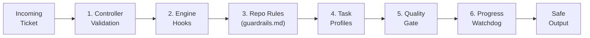

# Security

## Overview

Osmia orchestrates autonomous AI coding agents — software that can read, write,
and execute code against production repositories with minimal human supervision.
This makes security not merely a feature but a foundational design constraint.

The project follows a **security-first** philosophy: every architectural decision
is evaluated through the lens of the threat model. Agents are treated as
**untrusted workloads**. They run in ephemeral, sandboxed containers with the
absolute minimum privileges required. Multiple independent guard rail layers
ensure that a failure in any single layer does not result in a breach.

This document describes the controls in place and the rationale behind them.

---

## Threat Model

The following threats are considered primary risks when running autonomous AI
agents against live codebases.

| Threat | Description | Mitigations |
|---|---|---|
| **Prompt injection** | Malicious content in ticket descriptions or repository files tricks the agent into unintended behaviour. | Input sanitisation, command blocking hooks, guardrails.md/CLAUDE.md. |
| **Agent escape** | The agent breaks out of its intended scope — accessing files, networks, or APIs it should not. | Container isolation, NetworkPolicy, `readOnlyRootFilesystem`, hook-based command blocking. |
| **Secret exfiltration** | The agent leaks API keys or credentials via logs, network calls, or committed code. | No secrets in prompts, no secrets in logs, restricted egress, sensitive-file write blocking. |
| **Supply chain attacks** | Compromised dependencies or container images inject malicious code. | Distroless base images, image signing, SBOM generation, vulnerability scanning. |
| **Denial of service** | Runaway agents exhaust compute, tokens, or API quota. | ResourceQuotas, `ActiveDeadlineSeconds`, cost velocity watchdog, concurrent job limits. |
| **Cross-tenant data leakage** | In multi-tenant deployments, one tenant's data is exposed to another. | Namespace isolation, separate RBAC, separate secrets, optional dedicated node pools. |

---

## Defence in Depth — The Six Guard Rail Layers

Osmia enforces safety through six independent layers. Layers 1, 2, 5, and 6
are enforced by the controller at runtime. Layers 3 and 4 are advisory or
partially implemented — see the notes under each layer.



### Layer 1: Controller Validation

The reconciler (`internal/controller/controller.go`) validates every ticket
before creating a TaskRun:

- **Allowed repositories** — the ticket's `RepoURL` is matched against a
  configurable glob list (`guard_rails.allowed_repos`). Unrecognised repositories
  are rejected.
- **Allowed task types** — the ticket's `TicketType` must appear in
  `guard_rails.allowed_task_types`.
- **Concurrent job limit** — `guard_rails.max_concurrent_jobs` (default: 5)
  prevents resource exhaustion.

### Layer 2: Engine Hooks

The Claude Code engine (`pkg/engine/claudecode/hooks.go`) generates a
`settings.json` with `PreToolUse`, `PostToolUse`, and `Stop` hooks:

- **PreToolUse (Bash)** — runs `block-dangerous-commands.sh` before every shell
  command, blocking patterns such as `rm -rf /`, `curl|bash`, `sudo`, `eval`,
  `chmod 777`, and force-pushes to main/master.
- **PreToolUse (Write|Edit)** — runs `block-sensitive-files.sh`, blocking writes
  to `.env*`, `*.pem`, `*.key`, credential directories, and other sensitive paths.
- **PostToolUse** — writes a heartbeat to `/workspace/heartbeat.json` after every
  tool invocation, enabling watchdog telemetry.
- **Stop** — runs `on-complete.sh` to write `/workspace/result.json`.

### Layer 3: Guardrails.md / CLAUDE.md

A per-repository `guardrails.md` or `CLAUDE.md` file can instruct the agent
to follow repo-specific conventions — for example, forbidding changes to
deployment manifests or limiting modifications to specific directories.

These files take effect when a Claude Code agent reads its `CLAUDE.md`
naturally during execution. The controller does not currently inject them into
the agent prompt — prompt-builder injection is on the roadmap. This layer is
advisory: the agent may read and follow the file, but the controller does not
enforce compliance.

### Layer 4: Task Profiles

Task profiles define cost and duration budgets per task type. The config
schema is fully defined and values are stored, but per-task-type file pattern
restrictions (`allowed_file_patterns`, `blocked_file_patterns`) are not yet
enforced at runtime.

### Layer 5: Quality Gate

Before a pull request is merged, a quality gate reviews the agent's output.
This may include automated linting, test execution, and human approval
requirements, catching issues that slipped past earlier layers.

### Layer 6: Progress Watchdog

The watchdog (`internal/watchdog/watchdog.go`) continuously monitors running
agents for anomalous behaviour:

- **Loop detection** — terminates agents calling the same tool with identical
  arguments more than 10 consecutive times with no file progress.
- **Thrashing detection** — warns (then terminates) agents consuming more than
  80,000 tokens without meaningful file changes.
- **Stall detection** — terminates agents idle for more than 300 seconds.
- **Cost velocity** — warns when spending exceeds $15 USD per 10-minute window.
- **Telemetry failure** — warns when heartbeat sequence numbers stop advancing.
- **Unanswered human timeout** — terminates jobs waiting on human input for
  longer than 30 minutes.

All thresholds are configurable. Anomalies must persist for a minimum number of
consecutive ticks before action is taken, avoiding false positives.

---

## Container Security

Every agent job pod is created by the JobBuilder (`internal/jobbuilder/builder.go`)
with a restrictive `SecurityContext`:

```yaml
securityContext:
  runAsNonRoot: true
  runAsUser: 10000
  readOnlyRootFilesystem: true
  allowPrivilegeEscalation: false
  capabilities:
    drop: ["ALL"]
  seccompProfile:
    type: RuntimeDefault
```

Key properties:

- **runAsNonRoot / runAsUser: 10000** — containers never run as root. The agent
  user (`osmia`, UID 10000) has no elevated privileges.
- **readOnlyRootFilesystem** — prevents the agent from modifying the container
  filesystem outside of explicitly mounted writable volumes.
- **Drop ALL capabilities** — removes every Linux capability, including
  `NET_RAW`, `SYS_ADMIN`, and `PTRACE`.
- **allowPrivilegeEscalation: false** — prevents gaining privileges via setuid
  binaries or kernel exploits.
- **SeccompProfile: RuntimeDefault** — applies the container runtime's default
  seccomp filter, blocking dangerous syscalls.
- **ActiveDeadlineSeconds** — every job has a hard timeout, ensuring runaway
  agents are killed by the kubelet.

---

## Network Isolation

Agent pods should have tightly restricted network access. Osmia recommends a
**deny-all-by-default** NetworkPolicy with explicit egress allow-lists:

```yaml
apiVersion: networking.k8s.io/v1
kind: NetworkPolicy
metadata:
  name: osmia-agent-netpol
spec:
  podSelector:
    matchLabels:
      app: osmia-agent
  policyTypes:
    - Ingress
    - Egress
  ingress: []          # deny all inbound traffic
  egress:
    - to:
        - ipBlock:
            cidr: 0.0.0.0/0
      ports:
        - protocol: TCP
          port: 443    # HTTPS only — API endpoints, SCM
    - to:
        - namespaceSelector: {}
          podSelector:
            matchLabels:
              k8s-app: kube-dns
      ports:
        - protocol: UDP
          port: 53     # DNS resolution
```

Recommendations:

- **No inter-pod communication** — agent pods must not communicate with each
  other or with unrelated services.
- **Restrict egress by FQDN** — where supported by your CNI (e.g. Cilium),
  restrict egress to specific FQDNs such as `api.anthropic.com`,
  `api.github.com`, and your SCM host.
- **No inbound traffic** — agent pods do not serve any network endpoints.

---

## Secret Management

Secrets are injected into agent pods via Kubernetes `SecretKeyRef` references,
never as plain-text environment variables in the Job spec. The JobBuilder's
`buildEnvFromSources` function sources secrets from named Kubernetes Secrets:

```go
// Each secret is injected via a SecretRef, never as a literal value.
sources = append(sources, corev1.EnvFromSource{
    SecretRef: &corev1.SecretEnvSource{
        LocalObjectReference: corev1.LocalObjectReference{
            Name: secretName,
        },
    },
})
```

Hard rules:

- **No secrets in logs** — structured logging (via `slog`) does not include
  secret values. Log fields are explicitly chosen; there is no catch-all
  serialisation of request bodies.
- **No secrets in prompts** — API keys are injected as environment variables,
  never included in the task description or agent prompt.
- **No secrets in container images** — images contain no baked-in credentials.

For production deployments, integrate with an external secrets manager:

- **HashiCorp Vault** — use the Vault Agent injector or CSI driver.
- **AWS Secrets Manager** — use IRSA with the AWS Secrets Store CSI driver.
- **External Secrets Operator** — synchronises external secret stores to
  Kubernetes Secrets, providing a uniform interface regardless of backend.

---

## Input Validation

All external input is treated as untrusted. The controller validates ticket
content before it reaches an agent.

**Controller-level validation:**

- Repository URL must match an entry in `guard_rails.allowed_repos` (glob
  matching via `matchGlob`).
- Task type must be in `guard_rails.allowed_task_types`.
- Tickets from unknown sources or with missing fields are rejected.

**Command blocking** (`block-dangerous-commands.sh`):

The following patterns are blocked by default in the PreToolUse Bash hook:

| Pattern | Reason |
|---|---|
| `rm -rf /`, `rm -rf /*` | Filesystem destruction |
| `curl\|bash`, `wget\|sh` | Remote code execution |
| `eval`, `sudo` | Privilege escalation |
| `chmod 777` | Insecure permissions |
| `git push --force` to main/master | Destructive SCM operations |
| `mkfs.*`, `dd if=.*/dev/` | Disk/device manipulation |
| Fork bomb patterns | Denial of service |

**Sensitive file blocking** (`block-sensitive-files.sh`):

Writes to the following paths are blocked by default:

- `.env*` — environment files containing secrets
- `**/credentials/**`, `**/secrets/**` — credential directories
- `*.pem`, `*.key`, `*.p12`, `*.pfx`, `*.jks`, `*.keystore` — cryptographic keys

Both blocked-command and blocked-file lists are configurable via the engine
configuration and the `BLOCKED_FILE_PATTERNS` environment variable.

---

## Image Security

### Controller Image

The controller (`docker/controller/Dockerfile`) uses a **multi-stage build**:

1. **Builder stage** — `golang:1.23-alpine` compiles the binary with
   `-trimpath -ldflags="-s -w"`, stripping debug information and file paths.
2. **Runtime stage** — `gcr.io/distroless/static-debian12:nonroot` contains no
   shell, no package manager, and no unnecessary libraries. The `nonroot` tag
   ensures the image runs as a non-root user by default.

### Agent Image

The Claude Code engine image (`docker/engine-claude-code/Dockerfile`) uses
`node:22-slim` as a base (required for the Claude Code CLI), installs only
essential tools (`git`, `jq`, `gh`), and creates a dedicated non-root user
(`osmia`, UID 10000).

### Image Signing and Provenance

For production deployments, the following practices are recommended:

- **cosign** — sign all images with `cosign sign` and verify signatures in your
  admission controller (e.g. Kyverno, Gatekeeper).
- **SBOM generation** — generate software bills of materials with `syft` for
  every image build, enabling downstream vulnerability tracking.
- **Vulnerability scanning** — integrate `trivy`, `grype`, or your preferred
  scanner into CI. Fail builds on critical/high CVEs.
- **Pinned base images** — use image digests (`@sha256:...`) rather than mutable
  tags for reproducible builds.

---

## Multi-Tenancy Security

In multi-tenant deployments, each tenant should be isolated to prevent data
leakage and resource contention.

**Namespace isolation:**

- Deploy each tenant's workloads in a dedicated Kubernetes namespace.
- Apply NetworkPolicies per namespace to prevent cross-namespace traffic.

**RBAC separation:**

- Each tenant's service account should only have access to resources within its
  own namespace.
- Use `RoleBinding` (namespace-scoped) rather than `ClusterRoleBinding` for
  tenant-specific access.

**Secret isolation:**

- Secrets are namespace-scoped in Kubernetes by default. Ensure no
  `ClusterRoleBinding` grants cross-namespace secret access to tenant service
  accounts.

**Resource quotas:**

```yaml
apiVersion: v1
kind: ResourceQuota
metadata:
  name: osmia-tenant-quota
  namespace: tenant-a
spec:
  hard:
    requests.cpu: "8"
    requests.memory: 16Gi
    limits.cpu: "16"
    limits.memory: 32Gi
    count/jobs.batch: "10"
```

**Compute isolation (optional):**

For workloads requiring stronger isolation, use dedicated node pools with taints:

```yaml
# Karpenter NodePool example
apiVersion: karpenter.sh/v1beta1
kind: NodePool
metadata:
  name: tenant-a-agents
spec:
  template:
    spec:
      taints:
        - key: osmia.io/agent
          effect: NoSchedule
      requirements:
        - key: kubernetes.io/arch
          operator: In
          values: ["amd64"]
```

The JobBuilder automatically adds a toleration for `osmia.io/agent`, so agent
pods will schedule onto dedicated nodes when available.

---

## RBAC

The controller's service account (`charts/osmia/templates/rbac.yaml`) follows
the **principle of least privilege**:

| API Group | Resources | Verbs | Rationale |
|---|---|---|---|
| `batch` | `jobs` | create, delete, get, list, watch, update, patch | Manage agent job lifecycle |
| `""` (core) | `pods`, `pods/log` | get, list, watch | Monitor agent pod status and retrieve logs |
| `""` (core) | `configmaps` | get, list, watch, create, update, patch | Store controller state and configuration |
| `""` (core) | `secrets` | get, list, watch | Read secrets for injection into agent pods |
| `coordination.k8s.io` | `leases` | get, list, watch, create, update, patch, delete | Leader election |

Key constraints:

- The controller **cannot** create or modify Deployments, DaemonSets, or other
  workload types — only batch Jobs.
- The controller **cannot** create or modify Secrets — only read them.
- The controller **cannot** create or modify Namespaces, Nodes, or
  cluster-scoped resources beyond its own ClusterRole.
- For multi-tenant deployments, consider scoping the binding to a `Role` +
  `RoleBinding` per namespace instead of a `ClusterRole` + `ClusterRoleBinding`.

---

## Audit Logging

Osmia uses Go's standard `slog` package with structured JSON output for all
controller logs. Every significant action is logged with contextual fields:

```json
{
  "time": "2026-02-26T10:15:30Z",
  "level": "INFO",
  "msg": "job created",
  "ticket_id": "TICKET-1234",
  "engine": "claude-code",
  "job": "osmia-tr-TICKET-1234-1740564930000",
  "task_run_id": "tr-TICKET-1234-1740564930000"
}
```

Logged events include:

- Ticket polling and processing decisions
- Guard rail rejections (with reason)
- Job creation, completion, and failure
- Watchdog anomaly detections and actions taken
- Retry attempts
- Notification dispatch results

**Recommendations for production:**

- Forward controller logs to a centralised log aggregation system (e.g. Loki,
  Elasticsearch, Datadog) for retention and analysis.
- Enable Kubernetes audit logging at the API server level to capture all resource
  creation and modification events.
- Set up alerts on guard rail rejection events, watchdog terminations, and
  repeated job failures.
- Retain logs for a minimum of 90 days to support incident investigation.

---

## Vulnerability Disclosure

If you discover a security vulnerability in Osmia, please report it
responsibly. See the [Security Policy](security-policy.md) for our disclosure process.

Do not open public issues for security vulnerabilities.
